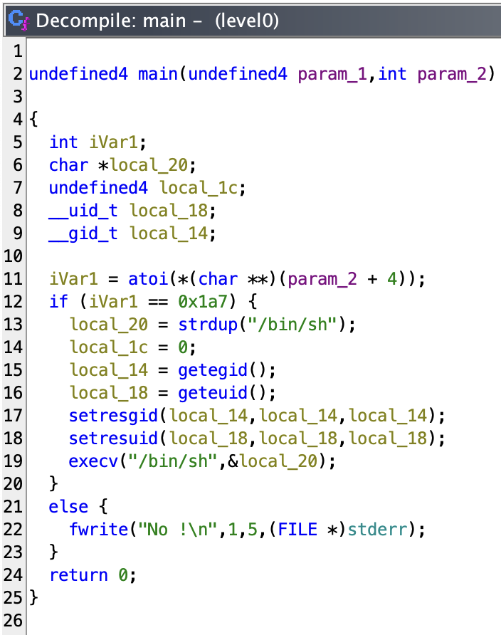
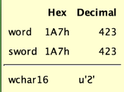

# level0

## `RainFall` is very different of `Snowcrash`. Let's start by seeing new things in this project :

- When we connect to the user `levelX`, we have a very strange output :
```sh
➜  ~ ssh level0@127.0.0.1 -p 4242
	  _____       _       ______    _ _
	 |  __ \     (_)     |  ____|  | | |
	 | |__) |__ _ _ _ __ | |__ __ _| | |
	 |  _  /  _` | | '_ \|  __/ _` | | |
	 | | \ \ (_| | | | | | | | (_| | | |
	 |_|  \_\__,_|_|_| |_|_|  \__,_|_|_|

                 Good luck & Have fun

  To start, ssh with level0/level0 on 10.0.2.15:4242
level0@127.0.0.1's password:
  GCC stack protector support:            Enabled
  Strict user copy checks:                Disabled
  Restrict /dev/mem access:               Enabled
  Restrict /dev/kmem access:              Enabled
  grsecurity / PaX: No GRKERNSEC
  Kernel Heap Hardening: No KERNHEAP
 System-wide ASLR (kernel.randomize_va_space): Off (Setting: 0)
RELRO           STACK CANARY      NX            PIE             RPATH      RUNPATH      FILE
No RELRO        No canary found   NX enabled    No PIE          No RPATH   No RUNPATH   /home/user/level0/level0
level0@RainFall:~$
```
It seems like a brief of vulnerability of this machin or account, I see that later.

- There's no `getflag` command or `flag00` user. The flag can be found in the file `.pass` of the levelX + 1. Exemple : I am logged as `level01`, I have to find a way to `cat` a file presents in the root of `level1` then log in as `level1` with the flag I found in the `.pass` file.

_Let's not lose good habits_ :
- `pwd`: `/home/user/level0`
- `id`: `uid=2020(level0) gid=2020(level0) groups=2020(level0),100(users)`
- `ls -la`:
```sh
total 737
dr-xr-x---+ 1 level0 level0     60 Mar  6  2016 .
dr-x--x--x  1 root   root      340 Sep 23  2015 ..
-rw-r--r--  1 level0 level0    220 Apr  3  2012 .bash_logout
-rw-r--r--  1 level0 level0   3530 Sep 23  2015 .bashrc
-rwsr-x---+ 1 level1 users  747441 Mar  6  2016 level0
-rw-r--r--  1 level0 level0    675 Apr  3  2012 .profile
```

_A binary, let's try it :_

```sh
level0@RainFall:~$ ./level0
Segmentation fault (core dumped)
level0@RainFall:~$
```

_Wow a segfault !_

```sh
level0@RainFall:~$ ./level0 "Noah my beloved"
No !
level0@RainFall:~$
```

_Okay let's get this binary file and decompile this :_

```sh
➜  ~ scp -P 4242 level0@127.0.0.1:/home/user/level0/level0 /Users/mayoub/Desktop/
	  _____       _       ______    _ _
	 |  __ \     (_)     |  ____|  | | |
	 | |__) |__ _ _ _ __ | |__ __ _| | |
	 |  _  /  _` | | '_ \|  __/ _` | | |
	 | | \ \ (_| | | | | | | | (_| | | |
	 |_|  \_\__,_|_|_| |_|_|  \__,_|_|_|

                 Good luck & Have fun

  To start, ssh with level0/level0 on 10.0.2.15:4242
level0@127.0.0.1's password:
level0                                                                                                                                                                    100%  730KB   1.4MB/s   00:00
➜  ~
```



- If I pass the right argument, it execute something weird. The char `0x1a7` is `423` in decimal, we can see it when hovering the value in [`ghidra`](https://ghidra-sre.org/) :



_Go passed 423 as arg :_

```sh
level0@RainFall:~$ ./level0 423
$
```

- Now, I am in a different `shell` but I have restricted permission :

```sh
$ ls
ls: cannot open directory .: Permission denied
$ pwd
/home/user/level0
$ id
uid=2030(level1) gid=2020(level0) groups=2030(level1),100(users),2020(level0)
$ cd ../level2
/bin/sh: 7: cd: can't cd to ../level2
$
```

- I have not permission to go levels higher than my current level.

**_Okay let's get the flag :_**

```sh
$ cat /home/user/level1/.pass
1fe8a524fa4bec01ca4ea2a869af2a02260d4a7d5fe7e7c24d8617e6dca12d3a
$
```

# _THAT WAS EASY_

- Let's exit the shell and log in to `level1`

```sh
$ exit
level0@RainFall:~$ su level1
Password:
RELRO           STACK CANARY      NX            PIE             RPATH      RUNPATH      FILE
No RELRO        No canary found   NX disabled   No PIE          No RPATH   No RUNPATH   /home/user/level1/level1
level1@RainFall:~$
```

- Here we cann see again these breachs checker but not the same results, I saw all that later.

# level0 complet !
